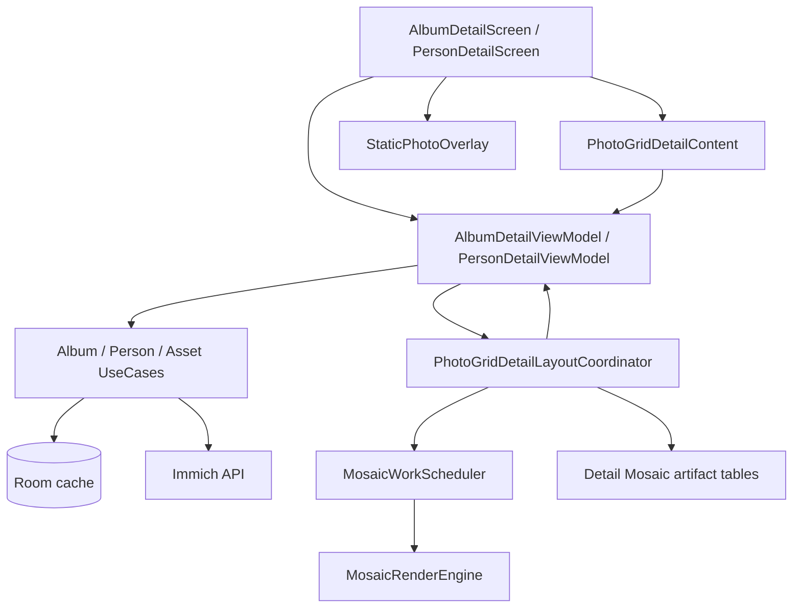
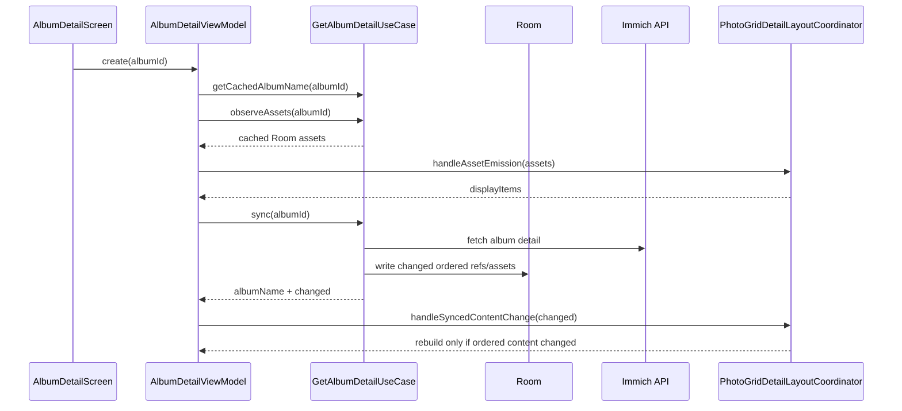
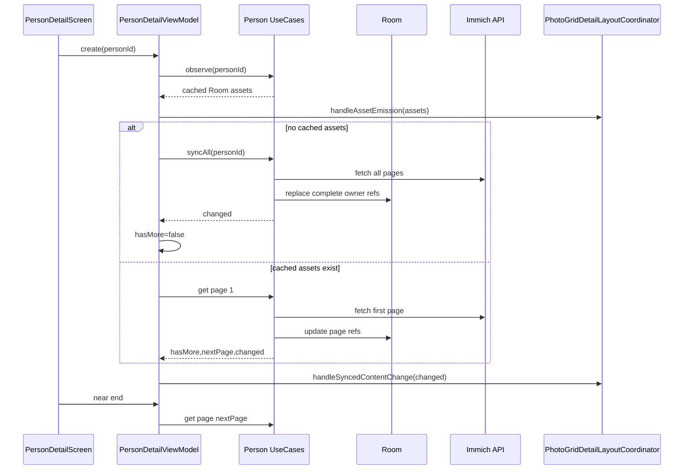
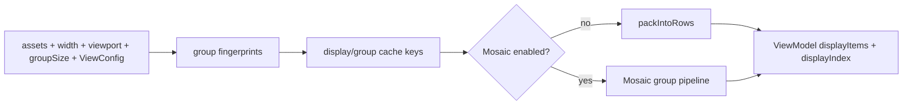
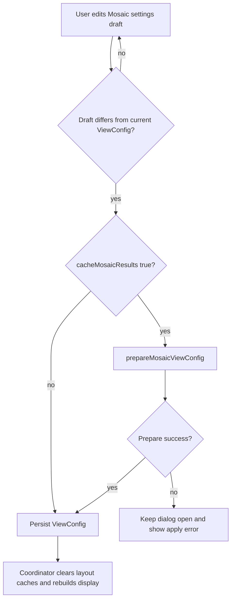
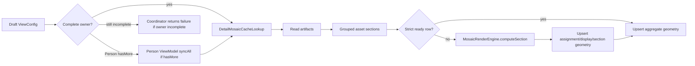
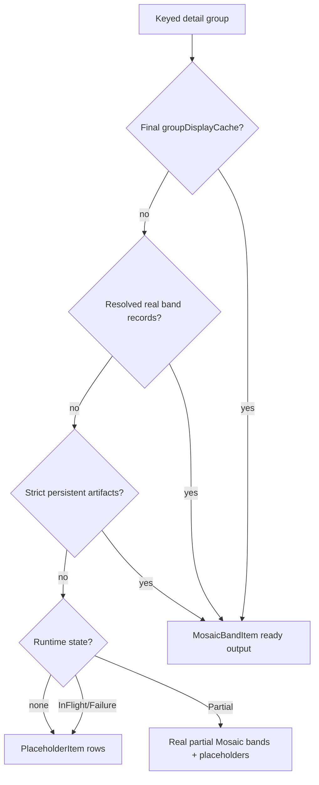
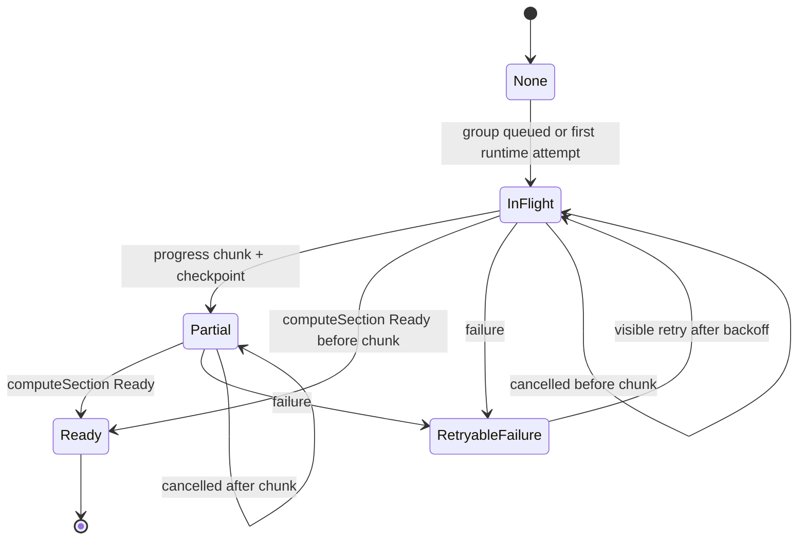
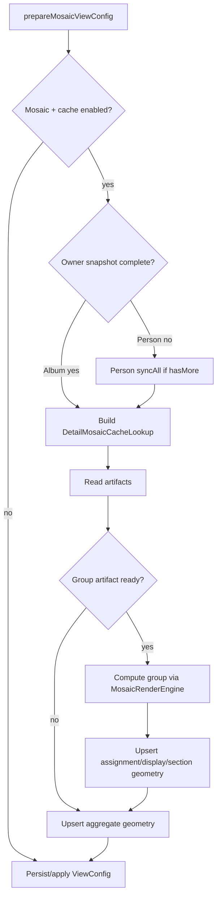

# Album And Person Detail Architecture

Load this when changing Album Detail or Person Detail screen behavior, cached-first loading, opened-owner sync, load-more, display projection, visible group reporting, overlay return targeting, or the shared `PhotoGridDetailLayoutCoordinator`.

For Mosaic assignment internals, use `docs/ai/mosaic-assignment.md`. For Mosaic scheduler/chunk policy, use `docs/ai/mosaic-runtime.md`. For standard justified rows, use `docs/ai/row-packing.md`. For persisted cache rules, use `docs/ai/data-cache-time.md`.

## Purpose

Album Detail and Person Detail are direct photo-grid screens backed by Room, Immich detail sync, shared row/Mosaic layout orchestration, and `StaticPhotoOverlay`.

Both screens share the same display architecture:

- A screen ViewModel owns owner-specific data loading, sync state, title/snackbar state, and overlay return state.
- `PhotoGridDetailLayoutCoordinator` owns layout state transitions, grouping, row-packing, Mosaic runtime work, persistent Mosaic artifact reads/writes, generation guards, and display publication.
- `PhotoGridDetailContent` owns Compose measurement and scroll/visibility reporting.
- Domain models own the display surface: `HeaderItem`, `RowItem`, `MosaicBandItem`, `PlaceholderItem`, and `ErrorItem`.
- Repositories and UseCases own network/Room synchronization. They must not pack rows or compute Mosaic assignments.

## Screen Responsibilities

`AlbumDetailScreen` and `PersonDetailScreen` are thin Compose shells:

- create and hold the `LazyListState`;
- activate/deactivate foreground Mosaic ownership through the ViewModel lifecycle;
- render `PhotoGridDetailContent`;
- render `DetailTopBar` with `PhotoGridDetailActions`;
- host `StaticPhotoOverlay`;
- preserve `lastViewedAssetId` and scroll back to the current display item after overlay dismissal.

The screens do not group assets, pack rows, compute Mosaic bands, read cache artifacts, or decide Mosaic fallback policy.

`PhotoGridDetailContent` reports:

- available grid width from `BoxWithConstraints`;
- visible grid height after top/bottom chrome padding;
- visible group indexes from `visibleBucketIndexesForDisplayIndexes(...)`;
- active scroll state from `LazyListState.isScrollInProgress`;
- near-end load-more triggers for Person Detail.

Zoom behavior is shared:

- row-packing mode supports pinch and desktop wheel zoom;
- Mosaic mode disables zoom when `disableZoomWhenMosaicEnabled` is true or when `cacheMosaicResults` is true;
- measured width and viewport height flow back to the coordinator so row bounds and Mosaic cell size are derived from actual layout.

## ViewModel Responsibilities

Album and Person ViewModels are owner-specific adapters around the shared coordinator.

Album Detail owns:

- `albumId` and album title;
- cached album-name lookup before network sync;
- `GetAlbumDetailUseCase.observeAssets(albumId)` collection;
- opened-album sync through `GetAlbumDetailUseCase.sync(albumId)`;
- banner versus full-screen error state;
- `DetailMosaicCacheOwnerType.ALBUM`;
- persistent Mosaic cache eligibility for the complete album snapshot.

Person Detail owns:

- `personId` and display name from navigation;
- `GetPersonAssetsUseCase.observe(personId)` collection;
- first-open full sync when no cached assets exist;
- warm page-1 refresh when cached assets exist;
- `loadMore()` pagination through `GetPersonAssetsPageUseCase`;
- duplicate load-more guards and sync-in-progress snackbar;
- `DetailMosaicCacheOwnerType.PERSON`;
- persistent Mosaic cache eligibility only when the full owner is known (`hasMore == false`).

Both ViewModels expose the same layout callbacks:

- `setAvailableWidth(...)`;
- `setAvailableViewportHeight(...)`;
- `setTargetRowHeight(...)`;
- `setGroupSize(...)`;
- `setViewConfig(...)`;
- `prepareMosaicViewConfig(...)`;
- `setVisibleBucketIndexes(...)`;
- `setScrollInProgress(...)`.

## Loading And Sync

Detail screens are cached-first. Room emissions are the render source of truth; network sync updates Room and returns whether ordered visible content changed.

Album Detail:

Person Detail:

Sync success and ordered content change are separate signals. Album-name updates, pagination flags, last-sync timestamps, and cache bookkeeping must not repack rows or rebuild Mosaic unless ordered assets or layout-affecting metadata changed.

Person load-more rules:

- ignore when sync/build is active and emit `SyncInProgress`;
- ignore when already loading more;
- ignore when `hasMore == false`;
- claim `isLoadingMore` atomically before launching the page request;
- update `hasMore` and `nextPage` only from the successful page response;
- call `handleSyncedContentChange(result.changed)` after page writes.

Opened-owner sync is separate from Mosaic settings. Sync can change the ordered
asset list, which may invalidate layout, but sync does not decide whether
Mosaic, Mosaic cache results, families, columns, or zoom behavior are enabled.
Those choices come from persisted `ViewConfig` and the Mosaic settings dialog.

## Layout Coordinator

`PhotoGridDetailLayoutCoordinator` is generic over the screen state type and receives state accessors from the owner ViewModel.

It owns:

- measured width and viewport-height derived row bounds;
- saved target row-height preference and debounced persistence;
- `GroupSize` and normalized `ViewConfig`;
- `PhotoGridLayoutRunner` for cancellable display projection;
- `assetRevision` and group fingerprints;
- full display cache for final complete output;
- per-group ready display cache;
- per-group resolved real Mosaic display-band cache;
- runtime Mosaic group states;
- deferred offscreen Mosaic publications;
- resume/retry jobs;
- persistent Mosaic artifact reads and writes.

Layout invalidation rules:

- Width, viewport height, row-height, group size, or view config changes clear layout caches and schedule a rebuild.
- Asset emissions bump `assetRevision` only when the current grouped fingerprint differs from the last rendered fingerprint.
- Content-change signals set `pendingSyncedContentRevision` when Room has not emitted the changed assets yet.
- If group order changes, all per-group display/runtime caches are cleared because `bucketIndex` is part of item identity.
- If only some groups changed, only those group caches and runtime states are removed.
- The resolved display-band cache is invalidated with the matching per-group display cache. It is keyed by the same group/config/fingerprint identity and is never allowed to outlive width, grouping, config, or ordered-content changes.

## Mosaic Settings

Album Detail and Person Detail use the shared `MosaicViewConfigIconMenu` through
`PhotoGridDetailActions`. The menu edits a draft `ViewConfig` and calls the
screen's `prepareMosaicViewConfig(...)` only when the draft has
`cacheMosaicResults = true`.

Settings owned by `ViewConfig`:

- `mosaicEnabled`: chooses Mosaic versus standard row-packing display.
- `mosaicFamilies`: chooses which Mosaic template families the engine may use.
- `mosaicColumnCount`: fixes Mosaic cell count and therefore cell height.
- `cacheMosaicResults`: chooses persistent artifact usage and blocking apply behavior.
- `disableZoomWhenMosaicEnabled`: disables row-height zoom while Mosaic is enabled.

Apply behavior:

When `cacheMosaicResults = false`:

- the dialog applies immediately without calling `prepareMosaicViewConfig(...)`;
- the normalized config is persisted through `SetViewConfigAction`;
- the coordinator clears in-memory layout caches and schedules a display rebuild;
- persistent detail Mosaic artifacts are not read because `persistentCacheLookup(...)` returns `null`;
- completed runtime groups are not written to persistent detail Mosaic artifacts because there is no lookup;
- Mosaic-enabled display still computes runtime Mosaic bands for visible/current groups through `MosaicWorkScheduler`;
- incomplete, failed, cancelled, or offscreen runtime groups render placeholders until real runtime Mosaic output exists;
- row-packing is used only when `mosaicEnabled = false`.

When `cacheMosaicResults = true`:

- the dialog enters an applying state and blocks dismissal;
- `prepareMosaicViewConfig(draft)` must complete before the config is persisted;
- if preparation fails, the current `ViewConfig` remains active and the dialog shows an apply error;
- if preparation succeeds, the draft config is persisted and the coordinator rebuilds against the prepared artifact identity.

Detail preparation algorithm:

1. Normalize the draft config.
2. Return success immediately if Mosaic is disabled or cache results are disabled.
3. Return success immediately if there are no assets.
4. Require a complete owner snapshot.
5. Require measured Mosaic layout metrics from current width and draft column count.
6. Build a `DetailMosaicCacheLookup` for owner, group size, draft columns, families, width/cell/max-row/spacing keys, and artifact versions.
7. Read existing artifacts and accept only strict ready display rows for the current owner fingerprint.
8. For each grouped section, reuse ready artifacts when valid.
9. Compute missing groups through `MosaicRenderEngine.computeSection(...)`.
10. Upsert assignment, display-band, and section-geometry artifacts for computed groups.
11. Once every group has output, upsert aggregate owner geometry.
12. Return success only after required preparation work completes.

The complete-owner requirement differs by screen:

- Album Detail: the album detail asset list is treated as complete after the
  album owner snapshot is cached.
- Person Detail: cache preparation cannot use partial paged data. If the user
  enables cached Mosaic results while `hasMore == true`, the ViewModel first
  performs `syncAll(personId)`, updates assets, sets `hasMore = false`, handles
  any content change, and only then prepares detail Mosaic artifacts.

Cache results affect runtime reads and writes, not opened-owner sync. Normal
album/person sync may update ordered assets; it does not build Mosaic artifacts
unless the settings path or runtime cache-enabled path needs them for the active
owner/config.

## Row-Packing Path

When Mosaic is disabled, the coordinator builds standard grouped justified rows:

1. Return empty display when assets are empty or width is not ready.
2. Group assets with `groupAssets(assets, groupSize)`.
3. Emit a `HeaderItem` for each non-empty group label.
4. Call `packIntoRows(...)` for each group with:
   - current measured width;
   - current target row height;
   - `GRID_SPACING_DP`;
   - `rowHeightBounds.max`;
   - normal wide-image promotion.
5. Store final output in the full display cache when the runner generation and asset revision still match.

Row-packing never uses Mosaic placeholders or Mosaic cache artifacts. Full algorithm details live in `docs/ai/row-packing.md`.

## Mosaic Display Path

When Mosaic is enabled and width/assets are ready, the coordinator builds one Mosaic section per grouped detail bucket.

Initial group item selection is ordered by group index:

1. Use in-memory `groupDisplayCache` if final ready output exists for the exact group/config/fingerprint.
2. Else rebuild final ready output from in-memory resolved real display-band records if they validate against the current ordered group assets.
3. Else use validated persistent display artifacts if cache results are enabled and the owner snapshot is complete. Persistent reads also seed the in-memory resolved-band cache when the stored bands are all real and fully cover the group.
4. Else use runtime partial/in-flight state if available.
5. Else render placeholders for the group.

The runtime group pipeline:

1. Build `KeyedAssetGroup` values from grouped assets, section labels, asset fingerprints, and exact layout/config keys.
2. Remove runtime states whose keys no longer exist.
3. During active scroll, mark offscreen groups as `InFlight` and compute only visible groups.
4. Outside active scroll, compute groups in visible-first order.
5. Run CPU work through `MosaicWorkScheduler`.
6. Call `MosaicRenderEngine.computeSection(...)` with checkpoint, progress chunk, and cancellation callbacks.
7. Publish valid partial chunks through `projectPartialSectionWithPlaceholders(...)`.
8. Publish completed ready output immediately for visible groups or defer offscreen replacement.
9. Store completed ready group items in `groupDisplayCache`. If the ready output is made entirely of real `MosaicBandItem` records and covers the current ordered group assets, also store portable `MosaicDisplayBandRecord` values in `groupDisplayBandCache`.
10. Write assignments, display bands, section geometry, and eventually aggregate geometry when persistent cache is eligible.
11. Cache the full display list only after every current group has final ready output and no placeholders remain.

Mosaic-enabled incomplete runtime states must render placeholders, not row-packing fallback and not fallback-thumbnail bands. Completed ready projection may contain fallback Mosaic bands if the engine produced them for the active config.

`groupDisplayBandCache` is an optimization only. Assignments and ready display items remain the canonical state for the current render pass, and fallback ready bands are deliberately excluded from the resolved-band cache. If resolved records are missing or fail coverage validation, the coordinator continues through persistent cache, runtime state, or placeholders rather than trusting stale geometry.

## Mosaic Scheduling

Album and Person Detail use `MosaicWorkScheduler`, not the Timeline queue actor.

Scheduler ownership:

- the screen activates its owner key on composition and clears/cancels it on disposal;
- work is keyed by `ownerKey` and `group_$index`;
- `ForegroundVisible` is used for visible groups;
- `ForegroundPrefetch` is used for non-visible groups in the active owner;
- pending work is reprioritized whenever visible group indexes change;
- running prefetch can be cancelled when visible work exists.

Scroll behavior:

- `setScrollInProgress(true)` cancels deferred publish flushes but keeps runtime checkpoints/chunks.
- While scrolling, only visible indexes are runnable.
- Offscreen missing groups become resumable `InFlight` placeholders.
- `setScrollInProgress(false)` schedules deferred publish flush and incomplete Mosaic resume.
- Resume snapshots `runtimeGroupStates` before iterating so mutation during resume cannot crash iteration.
- Retryable failures resume only when the group is in the visible prefetch window.
- Offscreen resume yields after each group so visible work can regain control.

Retry behavior:

- failure remains placeholder plus retryable runtime state;
- retry delay is exponential: `250ms`, `500ms`, `1000ms`, `2000ms`, `4000ms`, capped at `5000ms`;
- retry has no fixed attempt limit;
- ready output supersedes retry/partial/in-flight state for the active config.

## Persistent Mosaic Artifacts

Detail Mosaic persistence is owner-scoped:

- owner type: `ALBUM` or `PERSON`;
- owner id: album id or person id;
- group size;
- section index and section key;
- Mosaic column count;
- normalized families key;
- ordered asset fingerprint;
- width/cell-height/max-row-height/spacing geometry keys;
- artifact/display/geometry versions.

Artifacts:

- assignment rows store engine assignments;
- display rows store serialized ready `MosaicBandItem` bands;
- section geometry stores per-group placeholder height;
- aggregate geometry stores owner-level placeholder height for the complete ordered display.

Readiness requires matching assignment, section geometry, and aggregate geometry. Display rows are additionally required when `cacheMosaicResults = true`.

Strict persistent display read:

1. Aggregate geometry must match owner fingerprint and column count.
2. Assignment keys and section geometry keys must match the group key.
3. Display row column count must match.
4. Display bands must cover current ordered assets with no gaps, overlaps, duplicate ids, unknown ids, invalid dimensions, or mismatched source slices.
5. Invalid rows are treated as cache misses and runtime placeholders/compute take over.

Album cache policy:

- albums are complete owner snapshots once their detail assets are cached;
- Album Detail can read/write owner artifacts whenever cache is enabled and assets are available.

Person cache policy:

- People list must not preload per-person detail assets;
- Person Detail can render partial paged data at runtime;
- persistent owner Mosaic artifacts may be read/written only when `hasMore == false`;
- `prepareMosaicViewConfig(...)` with cache enabled performs full person sync first if pages remain.

## Overlay And Return Targeting

Both screens use `PhotoOverlayHost` and `StaticPhotoOverlay`.

Open flow:

1. Display item click passes asset id to `PhotoOverlayHost`.
2. `resolveInitialIndex` maps id into the current ordered asset list.
3. `StaticPhotoOverlay` pages through the same asset list and fetches asset details on demand.
4. The clicked grid cell is hidden through `hiddenAssetId` while shared transition is active.

Dismiss flow:

1. Overlay returns the current asset id.
2. ViewModel stores `lastViewedAssetId`.
3. Screen maps that id through `displayIndex.assetDisplayIndexById`.
4. If the item is not fully visible, the `LazyListState` scrolls to the mapped display item.

Display projection must keep `assetDisplayIndexById` accurate for row-packing, placeholders, partial Mosaic, ready Mosaic, cache reads, and hidden-asset transitions. Placeholder-only groups cannot provide an asset cell target, but once a real asset display item exists, overlay dismiss must land on the current asset.

## Failure And Empty States

Initial uncached failure:

- show full-screen error with retry;
- do not publish partial grid state with no cached assets.

Cached-owner refresh failure:

- keep cached grid visible;
- show dismissible banner;
- do not clear display items or layout caches.

Mosaic runtime failure:

- keep/restore placeholders for the group;
- store retryable runtime state;
- retry when visible or in the visible prefetch window;
- never poison `groupDisplayCache` or full `displayCache` with placeholders or partial output.

Load-more failure:

- clear `isLoadingMore`;
- keep current person assets and display output;
- a later near-end trigger may retry.

## Invariants

- ViewModels use UseCases and Actions, never repositories.
- Composables render `PhotoGridDisplayItem`s and report measurements/visibility only.
- Detail layout math lives in `PhotoGridDetailLayoutCoordinator`.
- Album/Person runtime Mosaic goes through `MosaicWorkScheduler` and `MosaicRenderEngine`.
- Timeline Mosaic queue rules must not be copied into detail screens.
- Search remains row-packing only and is not part of this architecture.
- Cache-disabled detail rendering must not read persistent Mosaic artifacts.
- Persistent Person Mosaic artifacts require a complete owner snapshot.
- Final display caches must not contain placeholders, partial runtime output, or `RowItem`s while Mosaic is enabled.
- Shared element return targeting depends on stable grid keys and `assetDisplayIndexById`.

## Verification Targets

When changing this area, prefer focused tests for:

- cached assets render before opened-owner sync completes;
- unchanged sync does not rebuild display items;
- changed sync invalidates only changed groups when group order is stable;
- group order changes clear group caches and runtime states;
- Person `loadMore()` ignores duplicate and sync-overlapping requests;
- Person cache preparation syncs the full owner before writing persistent artifacts;
- cache-disabled detail Mosaic skips persistent artifacts and computes runtime groups;
- visible Mosaic groups outrank offscreen work;
- scroll pause leaves offscreen groups resumable;
- retryable failures remain placeholders and later retry;
- partial chunks project real bands plus placeholders, not fallback-thumbnail bands;
- final ready groups can write assignments, display bands, section geometry, and aggregate geometry;
- overlay dismiss maps the current asset id to a valid display item after row/Mosaic transitions.
