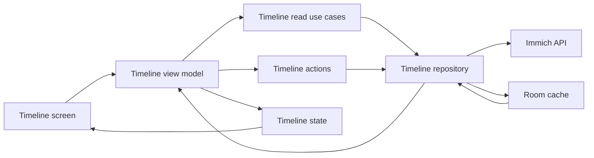
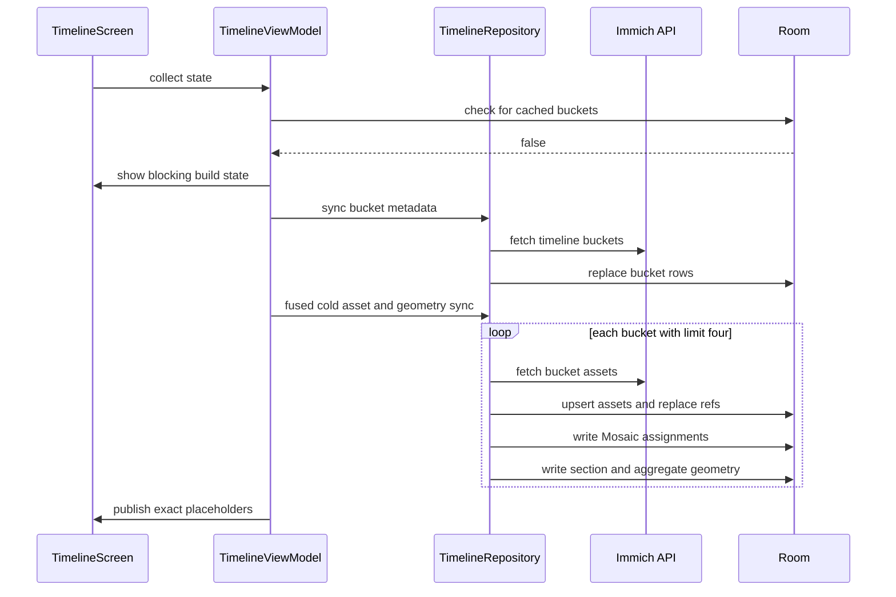
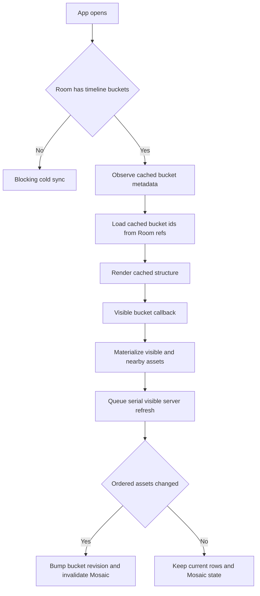
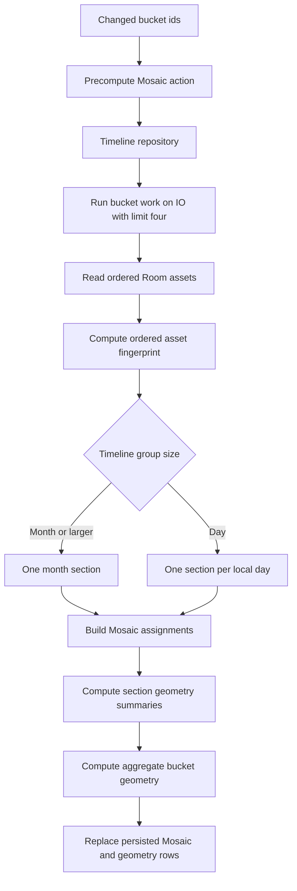
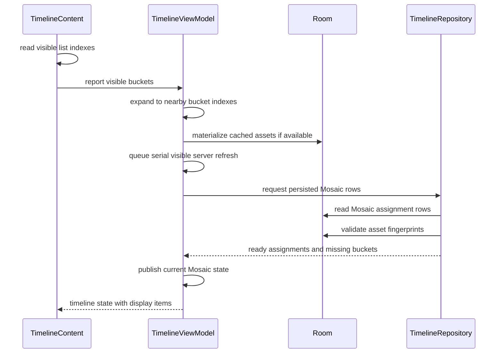
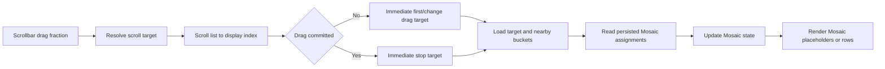
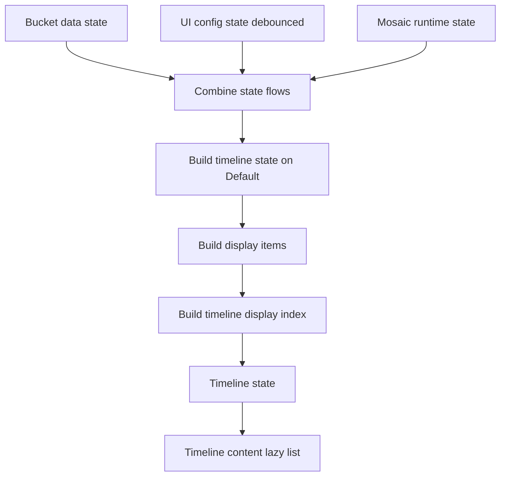

# Timeline Data, Cache, Mosaic, And Rendering

This document explains how the Timeline screen fetches data, caches it, computes
Mosaic layout data, and renders the photo grid. Keep this document updated when
changing Timeline cache, sync, Mosaic, scrollbar, overlay, or rendering behavior.

## Main Actors

- `TimelineScreen` owns Compose UI state that is local to the screen: lazy-list
  state, overlay selection, shared-element transition state, visible bucket
  reporting, scrollbar drag callbacks, and width/height reporting.
- `TimelineViewModel` owns Timeline screen state. It observes Room bucket
  metadata, materializes visible bucket assets, queues server refreshes, reads
  persisted Mosaic assignments, builds `TimelineState`, and keeps derived
  display-item caches.
- Timeline use cases/actions keep the ViewModel out of repositories:
  `GetTimelineBucketsUseCase`, `GetBucketAssetsUseCase`,
  `LoadBucketAssetsAction`, `SyncAllTimelineAssetsAction`,
  `PrecomputeTimelineMosaicAction`, and
  `GetTimelineMosaicAssignmentsUseCase`.
- `TimelineRepository` owns Immich API calls, Room writes, ordered asset change
  detection, persisted Mosaic assignment writes/reads, and sync metadata.
- Room stores bucket metadata, timeline asset refs, asset rows, and persisted
  Mosaic assignments. The in-memory `bucketAssetsCache` stores materialized
  assets for buckets currently needed by the grid or overlay.

## Data Fetching

Timeline uses cached-first loading only after a successful cold sync completion
marker exists in `sync_metadata`. Bucket metadata and bucket assets are
deliberately separate: metadata gives the scrollbar, placeholders, and bucket
order enough structure to render quickly, while assets are only materialized for
visible or nearby buckets. Metadata by itself is not a warm-cache signal because
a failed cold sync can write metadata before all aggregate geometry exists.

### `syncFromServer()` Flow

`TimelineViewModel.syncFromServer()` is the Timeline entry point for server
sync. It owns the user-facing loading flags and delegates actual cache writes to
UseCases/Actions.

For a cold first launch, or a retry after partial cold-sync metadata was written
without the completion marker, Timeline is a blocking, non-interactive screen.
`TimelineScreen` renders only a full-screen spinner and loading text, reports
that blocking state to `MainScreen`, and the shell hides top and bottom controls
until the cold sync succeeds or fails. The grid, scrollbar, overlay host,
banners, and visible-bucket effects are not composed while `_isBuilding` is
true.

The cold loading gate still reports layout metrics. Timeline is edge-to-edge and
occupies the full screen under system, top, and bottom bars, so the gate uses its
full `BoxWithConstraints` width and height to seed `availableWidth`,
`availableHeight`, and the fixed Timeline Mosaic column count. Normal content
uses the same full-surface height for geometry requests; toolbar and system-bar
padding affect interaction and scrollbar insets, not persisted Mosaic geometry.
After metrics are known:

1. `GetTimelineBucketsUseCase.sync()` refreshes bucket metadata.
2. `SyncAllTimelineAssetsAction` runs the cold fused path. For each bucket it
   fetches assets, writes refs, runs edit enrichment, builds Mosaic assignments,
   computes section geometry, computes aggregate bucket geometry, and persists
   all rows before the worker completes.
3. Any failed bucket keeps the blocking retry state. Cold startup does not open
   partially.
4. Successful cold sync marks buckets as cached and exact-geometry-ready for the
   current geometry key, not loaded, then writes the cold-complete marker. The
   first interactive render can use exact placeholders without reading every
   bucket's assets back into memory.
5. Visible/nearby or scrollbar-targeted buckets then materialize assets and
   hydrate Mosaic assignments on demand.

For warm launch with cached buckets and the cold-complete marker,
`syncFromServer()` refreshes bucket metadata only. It records stale/removed
buckets, keeps cached refs available, loads trusted aggregate bucket geometry
for all cached buckets, and lets visible/target bucket materialization drive
asset refreshes. Visible or targeted bucket refreshes still run changed-bucket
Mosaic assignment and geometry precompute after a successful content-changing
sync.

### Logcat Sync Progress

Timeline cold sync should be diagnosable from Logcat without interacting with
the UI. The authoritative high-level phase logs come from `TimelineViewModel`
under the `TimelineViewModel` tag:

- sync mode selection: `cold`, `cached-launch`, or `manual-refresh`.
- cold metric wait and metric readiness, including width, height, target row
  height, and Mosaic column count.
- bucket metadata sync start/completion, including bucket, stale, and removed
  counts.
- cold fused asset/Mosaic/geometry sync start/completion, including successful,
  failed, changed, and missing-geometry bucket counts.
- visible/targeted Mosaic reads after startup, including requested bucket
  counts, assignment counts, geometry counts, and failures.
- final cold-sync success or failure state.

Repository-level progress logs use the `TimelineRepository` tag. They report
bucket metadata fetch/write counts, fused cold per-bucket asset/ref/assignment/
geometry persistence, warm full asset sync progress, and Mosaic precompute
progress. Expected cancellation from superseded Mosaic cache reads should not be
treated as a user-facing sync failure.

Manual refresh is broader than warm launch. It blocks the visible-refresh queue,
refreshes bucket assets while preserving cached rows on failure, and recomputes
Mosaic assignments plus geometry summaries only for buckets whose ordered asset
content changed.

No-op sync success must not bump asset revisions, clear display caches, or
replace Mosaic/geometry rows. Removed buckets clear refs, assignments, and
geometry immediately.

### Cold Launch With No Cache

On first launch, `TimelineViewModel.syncFromServer()` checks whether cached
buckets exist and whether `sync_metadata` contains the Timeline cold-complete
scope. Missing metadata or a missing marker enters the blocking first-build
state via `_isBuilding`.

1. `GetTimelineBucketsUseCase.sync()` fetches `/api/timeline/buckets`.
2. `TimelineRepository.syncBuckets()` writes `TimelineBucketEntity` rows and
   updates sync metadata.
3. `SyncAllTimelineAssetsAction` syncs all buckets because there is no cached
   content to show.
4. Each bucket asset sync fetches `/api/timeline/bucket?timeBucket=...`, filters
   hidden assets, writes assets and `TimelineAssetCrossRef` rows, runs edit
   enrichment, computes Mosaic assignments, section geometry, and aggregate
   bucket geometry in the same worker.
5. All assignment and geometry rows are persisted before the bucket is counted
   successful.
6. `_bucketData` marks successful buckets cached and geometry-ready for the
   exact group/column/family/full-screen-geometry key, but not loaded. Exact
   placeholders render immediately after the blocking state ends; actual rows
   load only for visible/targeted buckets.
7. The repository writes the cold-complete marker only after all buckets produce
   aggregate geometry. If any bucket fails, retry remains in the cold path even
   though partial metadata or refs may already be cached.

### Warm Launch With Cache

Warm launch does not block on full asset sync. The ViewModel observes Room
bucket metadata immediately and pre-populates `cachedBuckets` from Room refs.
The server sync refreshes bucket metadata in the background, then visible asset
refreshes are queued separately.

1. `getLoadedBucketIds()` records which buckets have cached asset refs.
2. `observeBuckets()` emits cached `TimelineBucket` metadata.
3. The grid shows headers and placeholders until visible/nearby buckets are
   materialized from Room. Visible and explicitly targeted buckets always
   outrank stale offscreen work.
4. As the user scrolls, `onVisibleBucketsChanged()` loads visible/nearby bucket
   assets from Room if cached, moves those buckets to the front of the serial
   refresh queue, then refreshes them from the server.
5. Background bucket metadata sync does not refresh all assets on warm launch.
   It only marks stale/removed buckets and queues current visible buckets.
6. If a visible server refresh succeeds but ordered persisted assets did not
   change, the bucket remains loaded without bumping its content revision.

### Manual Refresh

Manual refresh is explicit and broader than warm launch background refresh. When
cached buckets exist, manual refresh first blocks the visible-refresh queue, then
refreshes bucket assets while keeping cached rows visible on failure. It ends by
showing an error banner if any bucket failed or a success banner when recovering
from a previous connection error.

## Cache And Invalidation Model

Timeline uses multiple cache layers, each with a different purpose.

- Room `timeline_buckets`: ordered bucket metadata from Immich.
- Room `timeline_asset_refs`: ordered relationship rows from bucket to asset.
- Room `assets`: shared asset metadata used by timeline, details, albums, and
  people where applicable.
- Room `timeline_mosaic_assignments`: persisted Mosaic assignments for a bucket
  or day section, keyed by group mode, fixed column count, asset fingerprint, and
  enabled Mosaic families.
- Room `timeline_mosaic_geometry`: width-keyed placeholder geometry summaries
  for persisted Mosaic sections. Geometry rows are keyed by assignment identity,
  rounded Timeline width, and geometry version; max row height and spacing are
  validation fields and stale rows are recomputed.
- Room `timeline_bucket_geometry`: width-keyed aggregate placeholder geometry
  for whole buckets. Unloaded buckets use this after cold sync and on warm
  launch, including day group mode where the aggregate includes day headers and
  spacing. Runtime readiness is keyed by bucket, group mode, column count,
  families, asset revision, rounded full Timeline width, max row height,
  spacing, and geometry version; missing exact geometry falls back to projected
  or count placeholders instead of rendering header-only.
- `bucketAssetsCache`: in-memory `timeBucket -> List<Asset>` used by both grid
  display building and `TimelinePhotoOverlay`.
- `_bucketData`: render-facing bucket state: buckets, cached, exact-key
  geometry-ready, loaded, loading, failed sets, and per-bucket `assetRevisions`.
  Geometry-ready means exact placeholder height exists for the active geometry
  key; it does not mean assets are materialized.
- `_uiConfig`: group size, row height, viewport, Mosaic config, banners, sync
  flags, and active Mosaic config.
- `_mosaicStates`: runtime view of persisted Mosaic assignment availability for
  sections that have been requested by the ViewModel.

Sync success and content change are intentionally separate. A server refresh can
succeed and write rows without changing ordered persisted assets. In that case
the ViewModel should not bump `assetRevisions`, clear display caches, or repack
the bucket. Only ordered content changes increment that bucket revision.

Removed buckets are different from count-changed buckets. Removed buckets clear
refs and Mosaic assignments immediately. Count-changed buckets keep old refs
until that bucket's asset refresh succeeds, so cached rows do not collapse while
background work is in flight.

## Mosaic Calculation

Timeline Mosaic avoids continuous computation while scrolling. The expensive
assignment calculation happens after server sync for buckets whose ordered asset
content changed. Scrolling normally or dragging the scrollbar only reads
persisted Mosaic assignments for loaded visible/nearby buckets.

Changed or missing Timeline Mosaic rows may also publish session-only
progressive chunks while the full assignment pass is still running. Progressive
chunks are not a Room persistence contract: they exist only in ViewModel runtime
state so large sections can show ready Mosaic content before the final complete
section row is written.

### When Mosaic Is Computed

Mosaic assignments are computed in these cases:

- Cold first sync: after all bucket assets are synced, changed successful
  buckets are precomputed.
- Visible bucket refresh: after a visible/nearby bucket server refresh succeeds
  and `TimelineBucketAssetSyncResult.changed == true`.
- Manual refresh: each refreshed bucket can trigger precompute if its ordered
  assets changed.
- Active config preservation: if a changed bucket needs both the requested
  config and an already-active Mosaic config, both configs may be precomputed so
  the screen can keep rendering the active config until the requested one is
  complete.

Mosaic assignments are not computed on normal scroll, scrollbar drag, width
changes, group-size changes, or Mosaic-family changes. Those events request
persisted cache reads. Missing rows remain placeholders or fall back to row
packing depending on the current bucket/section state.

### How Persisted Mosaic Is Built

`PrecomputeTimelineMosaicAction` delegates to
`TimelineRepository.precomputeTimelineMosaic()`. The repository limits bucket
work with `TIMELINE_MOSAIC_PRECOMPUTE_PARALLELISM = 4` and runs the work on
`Dispatchers.IO`.

For each bucket:

1. Read ordered persisted Room assets for the bucket.
2. Compute `orderedAssetsFingerprint(entities)`.
3. Convert entities to domain `Asset` models with the current base URL.
4. Split into Mosaic sections:
   - month/group modes use one month section.
   - day group mode splits assets by local date and writes one section per day.
5. For each section, call `buildMosaicAssignments()` using the fixed assignment
   `MosaicLayoutSpec`, grid spacing, and normalized enabled families.
   When progressive runtime updates are enabled for a missing or changed
   section, the same source-order scan emits an in-memory chunk after each
   stable batch of eight Mosaic bands. A chunk owns a contiguous source-asset
   range and may include delayed fallback gaps; unresolved gaps are held until a
   later batch so fallback rows do not strand incomplete rows before a future
   Mosaic boundary.
6. If a measured Timeline width is available, replay the assignments through
   the real display `MosaicLayoutSpec` and persist exact placeholder geometry
   summaries in `timeline_mosaic_geometry`.
7. Compute aggregate bucket geometry from the section geometry. In day mode this
   includes day section headers and inter-item spacing.
8. Replace rows for that exact bucket/group/column/family config in
   `timeline_mosaic_assignments`, section geometry, and aggregate bucket
   geometry.

Progressive chunks use the same generation, group mode, column count, Mosaic
families, bucket revision, and full-screen geometry identity as persisted cache
reads. Stale chunks must be ignored after a config, width, or content-revision
change. Once the complete persisted section row is available, `Ready`
assignments replace the partial runtime chunks.

Partial rendering must preserve source order: ready chunks render their final
Mosaic/fallback display items, and pending source ranges render placeholders.
Those placeholders use range-specific keys so LazyColumn identity does not
collide with full-section placeholders. Exact aggregate bucket geometry still
protects unloaded bucket height; partial section placeholders are best-effort
until the remaining Mosaic bands are computed, so the screen anchors the first
visible real asset when chunks replace placeholders above or inside the
viewport.

Progressive chunks are buffered in the ViewModel before entering
`_mosaicStates`. The buffer is protected by a mutex, deduplicates chunks by
source range, and only drains chunks for visible, nearby, or explicitly targeted
buckets. New chunk arrivals use a short 250 ms throttle so a large bucket does
not rebuild Timeline state for every computed band batch; visibility and
scrollbar-target changes flush immediately. The buffer has no memory cap today:
chunks are session-only, cleared on bucket/config invalidation, and superseded
by complete persisted assignment rows when those rows become available.

### Normal Scroll

Normal scroll is driven by `snapshotFlow` over visible lazy-list item indexes in
`TimelineContent`.

1. Compose reports visible display indexes.
2. `visibleBucketIndexesForDisplayIndexes()` maps them through
   `TimelineDisplayIndex`.
3. `onVisibleBucketsChanged(..., VisibleScroll)` stores visible bucket indexes,
   expands the request to nearby buckets, materializes cached assets
   immediately when available, moves those buckets ahead of stale pending
   refresh work, requests persisted Mosaic rows for loaded visible/nearby
   buckets, and updates the Mosaic anchor.
4. Cached bucket assets are materialized from Room before network refresh when
   possible, so cached rows can render immediately.
5. Persisted Mosaic rows are read for loaded requested buckets. A generation and
   config guard prevents stale reads from publishing after the user scrolls
   elsewhere or changes Mosaic config.
6. `_mosaicStates` receives `Ready` assignments for available sections. The
   state combine pipeline rebuilds only bucket/section display items whose cache
   key changed. Cache-read jobs superseded by newer visible/target requests are
   normal cancellation and should not be logged as load failures.
7. If progressive Mosaic chunks were buffered for any visible or nearby bucket,
   the ViewModel flushes them immediately; offscreen chunks remain buffered
   until their bucket becomes visible, nearby, targeted, invalidated, or
   replaced by a complete persisted row.

When scrolling stops, a second `snapshotFlow` sends `ScrollSettled`. This uses
the same visible bucket mapping, but it lets the ViewModel reprioritize around
the final settled viewport after fast gesture movement.

### Scrollbar Fast Scroll

Scrollbar dragging uses the Timeline page index instead of raw lazy-list item
fractions. This keeps scrollbar labels, year markers, handle position, and drag
targets aligned with asset counts instead of display row counts.

1. `ScrollbarOverlay` sends a fraction during drag.
2. `TimelineViewModel.scrollTargetForFraction()` maps that fraction through
   `TimelinePageIndex` and `TimelineDisplayIndex` to a `TimelineScrollTarget`.
3. The UI scrolls the `LazyColumn` to the target display index.
4. The first drag target and each bucket change call
   `onViewportBucketTargeted(..., ScrollbarDrag)` immediately. This target
   callback is the authoritative fast-scroll loading signal, including
   mid-bucket positions where no month header is visible.
5. Drag stop always calls `onViewportBucketTargeted(..., ScrollbarStop)`
   immediately, even if it stops on the last drag bucket.
6. The ViewModel loads the target bucket plus nearby buckets immediately from
   cache when possible. Drag buckets move ahead of normal offscreen work, older
   unstarted drag buckets are demoted, and the stopped bucket is ordered before
   its nearest neighbors and older work. In-flight refreshes are not canceled.
7. Persisted Mosaic rows are requested for loaded buckets. The ViewModel does
   not compute new Mosaic assignments during the drag.

### Mosaic Display State

`_mosaicStates` stores section-level runtime state:

- missing or `Pending`: render Mosaic placeholders for the bucket/section while
  Mosaic is enabled.
- `Ready(assignments)`: call `buildPhotoGridItemsWithMosaic()` to render Mosaic
  bands plus fallback rows around gaps.
- `Failed`: fall back to justified row packing using the Mosaic fallback policy.

Pending Mosaic placeholders should preserve list position. If cached assets and
persisted assignments are already available, the preferred placeholder height is
the persisted geometry summary for the current rounded Timeline width. If a
matching geometry row is missing but assignments are available, the repository
backfills the geometry row by replaying `buildPhotoGridItemsWithMosaic()` for
the current width. If cached assets are available but assignments are still
missing, the placeholder uses the same aspect-ratio-based Mosaic fallback row
packing that final failed/missing Mosaic sections use. Count-only bucket
metadata estimates are used only when asset rows have not been materialized yet.

Timeline Mosaic uses fixed column counts while enabled: 4 columns on normal
widths and 5 columns on large widths. Pinch and desktop zoom do not change
Timeline column count while Mosaic is enabled, and the Timeline grouping
control is disabled while Mosaic is enabled. Width, group mode, and Mosaic
family changes request persisted rows for the new config; they do not compute
assignments for unchanged buckets. `activeMosaicConfig` lets the ViewModel keep
using a previously complete config until the requested config is complete.

## Rendering Pipeline

The ViewModel builds state from three flows:

`buildDisplayItems()` caches derived items per bucket. The cache identity
includes group size, available width, target row height, max row height, Mosaic
column count, view config, bucket order, load/failure state, per-bucket asset
revision, and relevant Mosaic section state. Bucket order is part of the cache
identity because display items store `bucketIndex`; reusing items across bucket
insert/remove/reorder would corrupt scroll, click, and return targeting.

For each bucket, display items start with a header. Then the bucket renders one
of the following:

- `ErrorItem` if the bucket failed and has no cached rows to keep.
- `PlaceholderItem` rows if assets are not materialized yet or Mosaic rows are
  pending.
- `RowItem` rows from `packIntoRows()` when Mosaic is off or failed/fallback.
- `MosaicBandItem` bands from `buildPhotoGridItemsWithMosaic()` when persisted
  assignments are ready.

`TimelineContent` renders a `LazyColumn` with stable `gridKey` values and
content types based on display-item class. It also owns visible bucket reporting,
scrollbar callbacks, sticky header overlay, and sync banners.

Timeline remaps placeholder and Mosaic band keys into Timeline-local keys that
include bucket and section identity. Shared grid builders may produce keys that
are only unique inside one section; reusing those keys directly in the full
Timeline list can make Compose reuse the wrong item when placeholders transition
to partial or ready Mosaic rows. The screen renders with item-based
`LazyColumn.items(...)`, not index-based access, so content identity is driven by
these stable keys and display-item content type.

The sticky month header should derive its label from `TimelineDisplayIndex`, not
by rescanning or keying effects on the full `displayItems` list. The display
index carries `sectionLabelByDisplayIndex`, so the header can map the current
first visible item to a label even while progressive Mosaic updates replace rows
inside the same bucket. During a transient index/key mismatch it keeps the last
non-null label instead of briefly clearing the header.

When display items change while the user is scrolled inside loaded content, the
screen anchors the first visible real asset and its current item offset. After
the new `TimelineDisplayIndex` is published, it scrolls that asset back to the
same offset. This preserves the visible position when placeholders above or
inside the viewport are replaced by partial or ready Mosaic rows.

## Overlay And Return Targeting

`TimelineScreen` keeps the grid composed behind `TimelinePhotoOverlay` so
drag-to-dismiss can reveal the grid. The overlay receives:

- a projected `TimelineOverlayState` containing only page index and buckets.
- the shared `bucketAssetsCache`, so detail paging and grid display use the same
  materialized asset source.
- `onBucketNeeded`, so paging into an unloaded bucket can trigger lazy load.

When a photo opens, `getGlobalPhotoIndex()` first uses `TimelinePageIndex` and
`bucketAssetsCache` to find the asset without a Room round trip. On dismiss,
the overlay reports the current asset id and bucket. The screen asks the
ViewModel for a return display index, preferring the exact rendered asset and
falling back to the bucket placeholder/header when the asset row is not
materialized yet.

## Performance Invariants

- Warm launch must not read, sync, or pack every bucket before first render.
- Cold launch without a cold-complete marker is the only blocking Timeline sync
  path; warm launch and manual refresh keep cached UI available.
- Bucket metadata, cached refs, materialized assets, display items, and Mosaic
  assignments are distinct states; do not collapse them into one global loading
  flag or revision.
- Visible or scrollbar-targeted buckets preempt stale offscreen work. Cache
  materialization for those buckets should happen before their network refresh
  and before waiting for another visible-bucket boundary.
- Scrollbar drag-stop buckets outrank earlier drag buckets and nearby buckets.
  Do not debounce the bucket-loading signal; visible item/header reporting is a
  secondary settle signal after fast-scroll targeting.
- Placeholder heights should match final cached geometry as closely as possible:
  exact persisted geometry first, geometry backfilled from persisted
  assignments second, cached-asset aspect projection third, count-only metadata
  estimates last.
- Placeholder and Mosaic item keys must remain stable across placeholder,
  partial, and ready transitions. Include Timeline bucket and section identity
  when shared grid builders return section-local keys.
- Sticky header labels must use the precomputed Timeline display index and
  retain the last non-null label during transient progressive updates; do not
  key header state directly on the whole display-item list.
- Progressive Mosaic chunks should be throttled before publishing to UI state,
  but visibility and scrollbar-target changes must flush eligible chunks
  immediately. Do not debounce visible/target bucket loading.
- Aggregate geometry reads for warm launch are generation/config guarded. Stale
  reads from a previous group, Mosaic family set, column count, width, or
  full-screen height must be ignored.
- Bucket-load display updates must remain immediate for shared-element return
  transitions. Debounce zoom/config work, not bucket materialization signals.
- No-op syncs must not bump revisions or repack unchanged buckets.
- Scroll and scrollbar targeting may request persisted Mosaic rows, but must
  not run continuous Mosaic assignment computation.
- Stale Mosaic cache reads must not publish after generation/config changes, and
  cancellation from superseded reads is expected.
- Room asset rows should not store stale server URLs; domain assets reconstruct
  URLs from current server config where possible.
