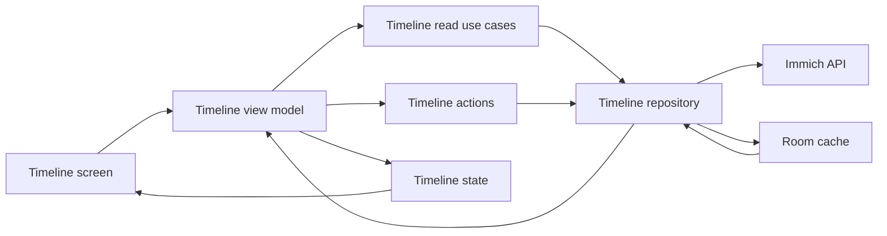
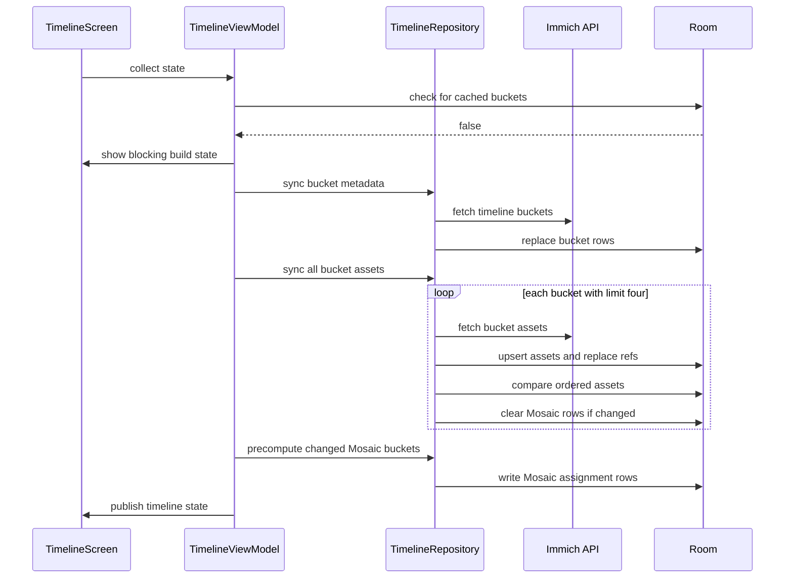
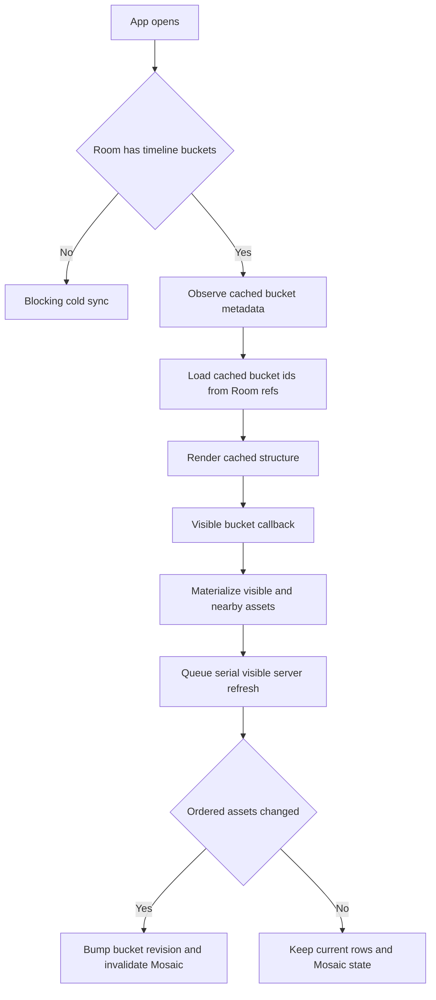
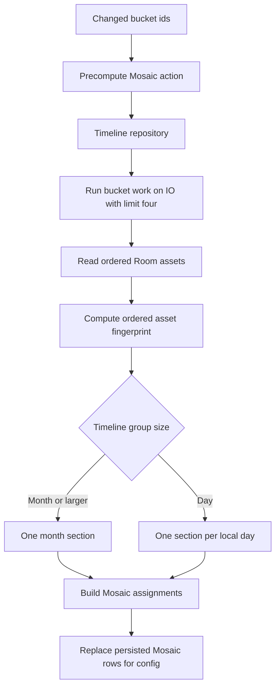
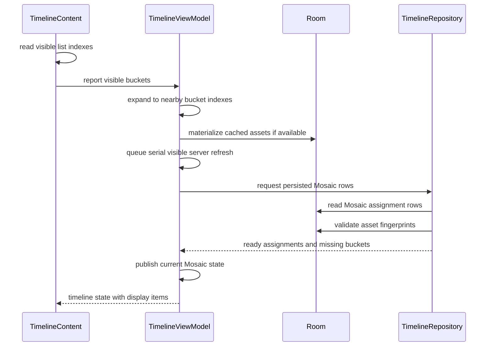
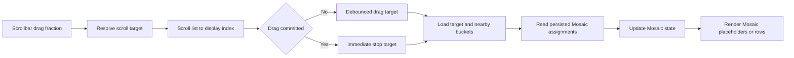
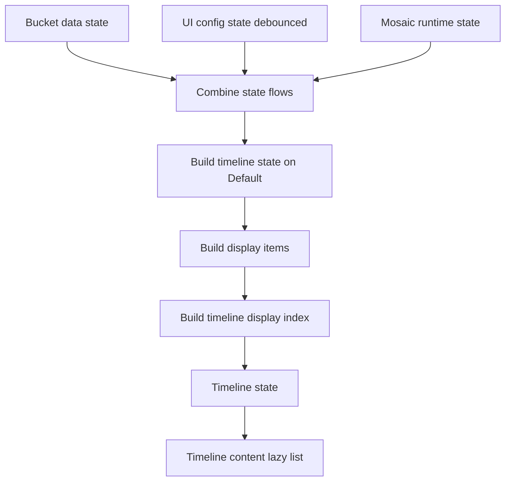

# Timeline Data, Cache, Mosaic, And Rendering

This document explains how the Timeline screen fetches data, caches it, computes
Mosaic layout data, and renders the photo grid. Keep this document updated when
changing Timeline cache, sync, Mosaic, scrollbar, overlay, or rendering behavior.

## Main Actors

- `TimelineScreen` owns Compose UI state that is local to the screen: lazy-list
  state, overlay selection, shared-element transition state, visible bucket
  reporting, scrollbar drag callbacks, and width/height reporting.
- `TimelineViewModel` owns Timeline screen state. It observes Room bucket
  metadata, materializes visible bucket assets, queues server refreshes, reads
  persisted Mosaic assignments, builds `TimelineState`, and keeps derived
  display-item caches.
- Timeline use cases/actions keep the ViewModel out of repositories:
  `GetTimelineBucketsUseCase`, `GetBucketAssetsUseCase`,
  `LoadBucketAssetsAction`, `SyncAllTimelineAssetsAction`,
  `PrecomputeTimelineMosaicAction`, and
  `GetTimelineMosaicAssignmentsUseCase`.
- `TimelineRepository` owns Immich API calls, Room writes, ordered asset change
  detection, persisted Mosaic assignment writes/reads, and sync metadata.
- Room stores bucket metadata, timeline asset refs, asset rows, and persisted
  Mosaic assignments. The in-memory `bucketAssetsCache` stores materialized
  assets for buckets currently needed by the grid or overlay.

## Data Fetching

Timeline uses cached-first loading when bucket metadata exists in Room. Bucket
metadata and bucket assets are deliberately separate: metadata gives the
scrollbar, placeholders, and bucket order enough structure to render quickly,
while assets are only materialized for visible or nearby buckets.

### Cold Launch With No Cache

On first launch, `TimelineViewModel.syncFromServer()` checks whether any cached
buckets exist. If not, it enters the blocking first-build state via
`_isBuilding`.

1. `GetTimelineBucketsUseCase.sync()` fetches `/api/timeline/buckets`.
2. `TimelineRepository.syncBuckets()` writes `TimelineBucketEntity` rows and
   updates sync metadata.
3. `SyncAllTimelineAssetsAction` syncs all buckets because there is no cached
   content to show.
4. Each bucket asset sync fetches `/api/timeline/bucket?timeBucket=...`, filters
   hidden assets, writes assets and `TimelineAssetCrossRef` rows, runs edit
   enrichment, compares ordered persisted assets before/after, and clears
   persisted Mosaic assignments only when content changed.
5. Changed successful buckets precompute Mosaic assignments and persist them.
6. `_bucketData` marks successful buckets loaded, increments revisions only for
   changed buckets, and the state pipeline builds display items for rendering.

### Warm Launch With Cache

Warm launch does not block on full asset sync. The ViewModel observes Room
bucket metadata immediately and pre-populates `cachedBuckets` from Room refs.
The server sync refreshes bucket metadata in the background, then visible asset
refreshes are queued separately.

1. `getLoadedBucketIds()` records which buckets have cached asset refs.
2. `observeBuckets()` emits cached `TimelineBucket` metadata.
3. The grid shows headers and placeholders until visible/nearby buckets are
   materialized from Room.
4. As the user scrolls, `onVisibleBucketsChanged()` loads visible/nearby bucket
   assets from Room if cached, then refreshes those buckets from the server.
5. Background bucket metadata sync does not refresh all assets on warm launch.
   It only marks stale/removed buckets and queues current visible buckets.
6. If a visible server refresh succeeds but ordered persisted assets did not
   change, the bucket remains loaded without bumping its content revision.

### Manual Refresh

Manual refresh is explicit and broader than warm launch background refresh. When
cached buckets exist, manual refresh first blocks the visible-refresh queue, then
refreshes bucket assets while keeping cached rows visible on failure. It ends by
showing an error banner if any bucket failed or a success banner when recovering
from a previous connection error.

## Cache And Invalidation Model

Timeline uses multiple cache layers, each with a different purpose.

- Room `timeline_buckets`: ordered bucket metadata from Immich.
- Room `timeline_asset_refs`: ordered relationship rows from bucket to asset.
- Room `assets`: shared asset metadata used by timeline, details, albums, and
  people where applicable.
- Room `timeline_mosaic_assignments`: persisted Mosaic assignments for a bucket
  or day section, keyed by group mode, fixed column count, asset fingerprint, and
  enabled Mosaic families.
- `bucketAssetsCache`: in-memory `timeBucket -> List<Asset>` used by both grid
  display building and `TimelinePhotoOverlay`.
- `_bucketData`: render-facing bucket state: buckets, cached/loaded/loading/
  failed sets, and per-bucket `assetRevisions`.
- `_uiConfig`: group size, row height, viewport, Mosaic config, banners, sync
  flags, and active Mosaic config.
- `_mosaicStates`: runtime view of persisted Mosaic assignment availability for
  sections that have been requested by the ViewModel.

Sync success and content change are intentionally separate. A server refresh can
succeed and write rows without changing ordered persisted assets. In that case
the ViewModel should not bump `assetRevisions`, clear display caches, or repack
the bucket. Only ordered content changes increment that bucket revision.

Removed buckets are different from count-changed buckets. Removed buckets clear
refs and Mosaic assignments immediately. Count-changed buckets keep old refs
until that bucket's asset refresh succeeds, so cached rows do not collapse while
background work is in flight.

## Mosaic Calculation

Timeline Mosaic avoids continuous computation while scrolling. The expensive
assignment calculation happens after server sync for buckets whose ordered asset
content changed. Scrolling normally or dragging the scrollbar only reads
persisted Mosaic assignments for loaded visible/nearby buckets.

### When Mosaic Is Computed

Mosaic assignments are computed in these cases:

- Cold first sync: after all bucket assets are synced, changed successful
  buckets are precomputed.
- Visible bucket refresh: after a visible/nearby bucket server refresh succeeds
  and `TimelineBucketAssetSyncResult.changed == true`.
- Manual refresh: each refreshed bucket can trigger precompute if its ordered
  assets changed.
- Active config preservation: if a changed bucket needs both the requested
  config and an already-active Mosaic config, both configs may be precomputed so
  the screen can keep rendering the active config until the requested one is
  complete.

Mosaic assignments are not computed on normal scroll, scrollbar drag, width
changes, group-size changes, or Mosaic-family changes. Those events request
persisted cache reads. Missing rows remain placeholders or fall back to row
packing depending on the current bucket/section state.

### How Persisted Mosaic Is Built

`PrecomputeTimelineMosaicAction` delegates to
`TimelineRepository.precomputeTimelineMosaic()`. The repository limits bucket
work with `TIMELINE_MOSAIC_PRECOMPUTE_PARALLELISM = 4` and runs the work on
`Dispatchers.IO`.

For each bucket:

1. Read ordered persisted Room assets for the bucket.
2. Compute `orderedAssetsFingerprint(entities)`.
3. Convert entities to domain `Asset` models with the current base URL.
4. Split into Mosaic sections:
   - month/group modes use one month section.
   - day group mode splits assets by local date and writes one section per day.
5. For each section, call `buildMosaicAssignments()` using the fixed assignment
   `MosaicLayoutSpec`, grid spacing, and normalized enabled families.
6. Replace rows for that exact bucket/group/column/family config in
   `timeline_mosaic_assignments`.

### Normal Scroll

Normal scroll is driven by `snapshotFlow` over visible lazy-list item indexes in
`TimelineContent`.

1. Compose reports visible display indexes.
2. `visibleBucketIndexesForDisplayIndexes()` maps them through
   `TimelineDisplayIndex`.
3. `onVisibleBucketsChanged(..., VisibleScroll)` stores visible bucket indexes,
   expands the request to nearby buckets, queues lazy asset materialization/
   refresh, requests persisted Mosaic rows for loaded visible/nearby buckets,
   and updates the Mosaic anchor.
4. Cached bucket assets are materialized from Room before network refresh when
   possible, so cached rows can render immediately.
5. Persisted Mosaic rows are read for loaded requested buckets. A generation and
   config guard prevents stale reads from publishing after the user scrolls
   elsewhere or changes Mosaic config.
6. `_mosaicStates` receives `Ready` assignments for available sections. The
   state combine pipeline rebuilds only bucket/section display items whose cache
   key changed.

When scrolling stops, a second `snapshotFlow` sends `ScrollSettled`. This uses
the same visible bucket mapping, but it lets the ViewModel reprioritize around
the final settled viewport after fast gesture movement.

### Scrollbar Fast Scroll

Scrollbar dragging uses the Timeline page index instead of raw lazy-list item
fractions. This keeps scrollbar labels, year markers, handle position, and drag
targets aligned with asset counts instead of display row counts.

1. `ScrollbarOverlay` sends a fraction during drag.
2. `TimelineViewModel.scrollTargetForFraction()` maps that fraction through
   `TimelinePageIndex` and `TimelineDisplayIndex` to a `TimelineScrollTarget`.
3. The UI scrolls the `LazyColumn` to the target display index.
4. Intermediate drag targets debounce for `SCROLLBAR_TARGET_DEBOUNCE_MS` and
   call `onViewportBucketTargeted(..., ScrollbarDrag)`.
5. Drag stop calls `onViewportBucketTargeted(..., ScrollbarStop)` immediately.
6. The ViewModel loads the target bucket plus nearby buckets and requests
   persisted Mosaic rows for loaded buckets. It does not compute new Mosaic
   assignments during the drag.

### Mosaic Display State

`_mosaicStates` stores section-level runtime state:

- missing or `Pending`: render Mosaic placeholders for the bucket/section while
  Mosaic is enabled.
- `Ready(assignments)`: call `buildPhotoGridItemsWithMosaic()` to render Mosaic
  bands plus fallback rows around gaps.
- `Failed`: fall back to justified row packing using the Mosaic fallback policy.

Timeline Mosaic uses fixed column counts while enabled: 4 columns on normal
widths and 5 columns on large widths. Pinch and desktop zoom do not change
Timeline column count while Mosaic is enabled. Width, group mode, and Mosaic
family changes request persisted rows for the new config; they do not compute
assignments for unchanged buckets. `activeMosaicConfig` lets the ViewModel keep
using a previously complete config until the requested config is complete.

## Rendering Pipeline

The ViewModel builds state from three flows:

`buildDisplayItems()` caches derived items per bucket. The cache identity
includes group size, available width, target row height, max row height, Mosaic
column count, view config, bucket order, load/failure state, per-bucket asset
revision, and relevant Mosaic section state. Bucket order is part of the cache
identity because display items store `bucketIndex`; reusing items across bucket
insert/remove/reorder would corrupt scroll, click, and return targeting.

For each bucket, display items start with a header. Then the bucket renders one
of the following:

- `ErrorItem` if the bucket failed and has no cached rows to keep.
- `PlaceholderItem` rows if assets are not materialized yet or Mosaic rows are
  pending.
- `RowItem` rows from `packIntoRows()` when Mosaic is off or failed/fallback.
- `MosaicBandItem` bands from `buildPhotoGridItemsWithMosaic()` when persisted
  assignments are ready.

`TimelineContent` renders a `LazyColumn` with stable `gridKey` values and
content types based on display-item class. It also owns visible bucket reporting,
scrollbar callbacks, sticky header overlay, and sync banners.

## Overlay And Return Targeting

`TimelineScreen` keeps the grid composed behind `TimelinePhotoOverlay` so
drag-to-dismiss can reveal the grid. The overlay receives:

- a projected `TimelineOverlayState` containing only page index and buckets.
- the shared `bucketAssetsCache`, so detail paging and grid display use the same
  materialized asset source.
- `onBucketNeeded`, so paging into an unloaded bucket can trigger lazy load.

When a photo opens, `getGlobalPhotoIndex()` first uses `TimelinePageIndex` and
`bucketAssetsCache` to find the asset without a Room round trip. On dismiss,
the overlay reports the current asset id and bucket. The screen asks the
ViewModel for a return display index, preferring the exact rendered asset and
falling back to the bucket placeholder/header when the asset row is not
materialized yet.

## Performance Invariants

- Warm launch must not read, sync, or pack every bucket before first render.
- Bucket metadata, cached refs, materialized assets, display items, and Mosaic
  assignments are distinct states; do not collapse them into one global loading
  flag or revision.
- Bucket-load display updates must remain immediate for shared-element return
  transitions. Debounce zoom/config work, not bucket materialization signals.
- No-op syncs must not bump revisions or repack unchanged buckets.
- Scroll and scrollbar targeting may request persisted Mosaic rows, but must
  not run continuous Mosaic assignment computation.
- Stale Mosaic cache reads must not publish after generation/config changes.
- Room asset rows should not store stale server URLs; domain assets reconstruct
  URLs from current server config where possible.
