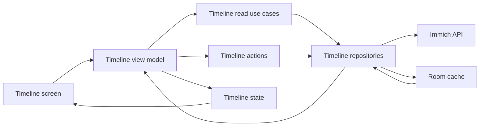
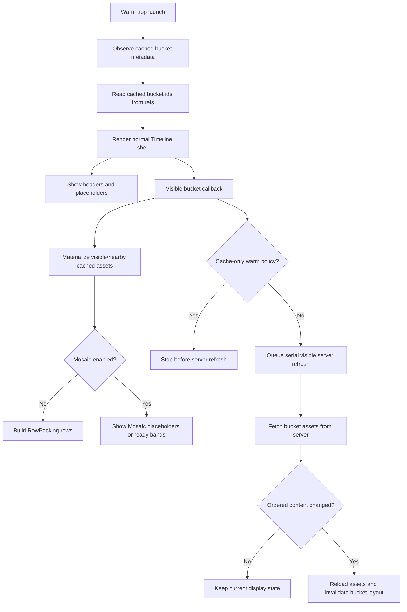
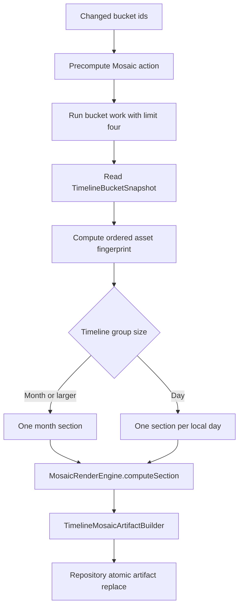
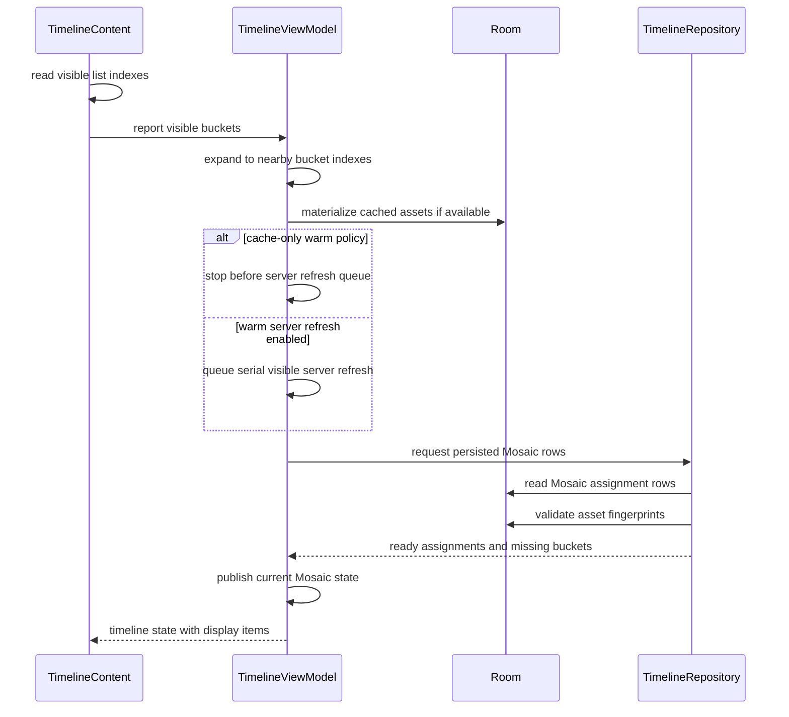
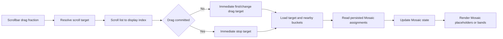
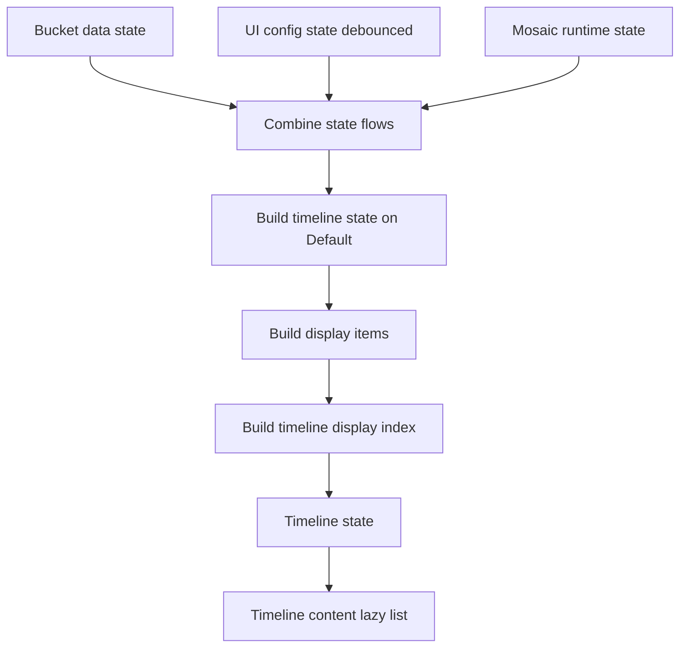

# Timeline Data, Cache, Mosaic, And Rendering

This document explains how the Timeline screen fetches data, caches it, computes
Mosaic layout data, and renders the photo grid. Keep this document updated when
changing Timeline cache, sync, Mosaic, scrollbar, overlay, or rendering behavior.
For cross-screen Mosaic architecture and shared engine/cache rules, also read
`docs/ai/mosaic-rendering.md`.
For standard justified row packing, also read `docs/ai/row-packing.md`.
For cold sync, warm launch, manual refresh, and no-op bucket refresh rules, also
read `docs/ai/timeline-sync.md`.

## Main Actors

- `TimelineScreen` owns Compose UI state that is local to the screen: lazy-list
  state, overlay selection, shared-element transition state, visible bucket
  reporting, scrollbar drag callbacks, and width/height reporting.
- `TimelineViewModel` owns Timeline screen state. It observes Room bucket
  metadata, materializes visible bucket assets, optionally queues server
  refreshes according to the Timeline sync policy, reads persisted Mosaic
  assignments, builds `TimelineState`, and keeps derived display-item caches.
- Timeline use cases/actions keep the ViewModel out of repositories:
  `GetTimelineBucketsUseCase`, `GetBucketAssetsUseCase`,
  `LoadBucketAssetsAction`, `SyncAllTimelineAssetsAction`,
  `PrepareTimelineMosaicCacheAction`, and
  `GetTimelineMosaicCacheStatusUseCase`.
- `TimelineRepository` owns Immich API calls, bucket/asset Room writes, ordered
  asset change detection, and sync metadata.
- `TimelineMosaicCacheRepository` owns persisted Timeline Mosaic assignment,
  display-cache, section geometry, and aggregate geometry reads/writes. Mosaic
  assignment, progressive chunks, fallback projection, and geometry math go
  through the domain `MosaicRenderEngine`; old split Timeline/detail renderer
  logic must not be reintroduced.
- Room stores bucket metadata, timeline asset refs, asset rows, and persisted
  Mosaic assignments. The in-memory `bucketAssetsCache` stores materialized
  assets for buckets currently needed by the grid or overlay.

## Sync Overview

Timeline sync architecture is documented in `docs/ai/timeline-sync.md`. Keep the
details there so cold sync, warm launch, manual refresh, no-op refresh handling,
and cache-off Mosaic policy have a single source of truth.

In short:

- Cold sync is blocking and writes the cold-complete marker only after required
  asset sync succeeds and, when cache results are enabled, Mosaic geometry is
  prepared.
- Warm launch is cached-first: it keeps cached refs visible and materializes
  only visible or targeted bucket assets. Current cache-only warm policy skips
  non-manual server refresh; if that policy is disabled, warm launch may also
  refresh metadata and visible bucket assets in the background.
- Manual refresh blocks the visible-refresh queue, refreshes every metadata
  bucket while preserving cached rows on failure, and clears all Mosaic caches
  first when `cacheMosaicResults = false`.
- Unchanged bucket refreshes must not rewrite rows, bump asset revisions, repack
  RowPacking output, or enqueue Mosaic work.

## Warm Launch Screen Flow

This section describes what the user sees and how the Timeline screen behaves
during warm sync. The lower-level sync algorithm lives in
`docs/ai/timeline-sync.md`.

Warm launch starts when Room has cached bucket metadata and the Timeline cold-
complete marker exists. The screen must become interactive from cached
structure; it must not wait for every bucket's server refresh.

1. `TimelineViewModel` observes cached `timeline_buckets`.
2. It reads loaded bucket ids from `timeline_asset_refs` and records those ids
   in `_bucketData.cachedBuckets`.
3. `TimelineScreen` renders the normal interactive Timeline, not the blocking
   cold-sync gate.
4. Buckets with only metadata render headers and placeholders. They are not
   considered loaded until their assets are materialized into
   `bucketAssetsCache`.
5. Cached aggregate geometry can provide accurate placeholder heights for
   unloaded Mosaic buckets. Missing geometry falls back to projected or count-
   based placeholders. Bucket-aggregate and per-section geometry read together
   for visible/target buckets plus radius neighbors first. `timelineGeometryReady`
   gates only that priority phase and opens even on read failure so visible
   Mosaic work cannot stall; remaining cached bucket geometry hydrates afterward
   in small offscreen chunks.
6. Under the current cache-only warm policy, no background server sync runs on
   warm launch. If warm server refresh is enabled, a background sync refreshes
   bucket metadata and records stale or removed buckets without fetching every
   bucket's assets.
7. Visible bucket reporting starts immediately from `TimelineContent`. The
   screen maps visible display indexes through `TimelineDisplayIndex` to bucket
   indexes, then calls `onVisibleBucketsChanged(...)`.
8. The ViewModel expands visible buckets to the nearby prefetch window and
   materializes cached assets for those buckets from Room before any optional
   network work. Materialization is batched: visible/target buckets publish
   first, then nearby prefetch buckets publish in small chunks with cooperative
   yields between chunks.
9. Materialized buckets update `bucketAssetsCache`, become loaded in
   `_bucketData`, bump a render-only materialization revision, and rebuild only
   their derived display items. Batched publication avoids one RowPacking/
   display-index rebuild per nearby bucket during the first scroll window. If
   Mosaic is disabled, this is where standard RowPacking rows appear. If Mosaic
   is enabled, loaded sections render placeholders until current-config Mosaic
   state is ready.
10. Under cache-only warm policy, the flow stops here for server work; the next
   server update comes from manual refresh. If warm server refresh is enabled,
   the same visible/nearby buckets are queued for serial server refresh, with
   visible or targeted buckets ahead of stale offscreen refresh work.
11. If a server refresh returns unchanged ordered content for an already-loaded
   bucket, the screen keeps the existing rows/bands without bumping the bucket
   revision or re-requesting Mosaic.
12. If a server refresh changes ordered content, that bucket alone reloads Room
   assets, increments its asset revision, clears stale Mosaic state for that
   bucket, and rebuilds its display items.

Warm sync should feel like a cached screen. The user can scroll, open the
overlay, use the scrollbar, and load targeted buckets while Room-backed assets
materialize. Under cache-only warm policy there is no background repair until
manual refresh; when warm server refresh is enabled, metadata sync and visible
bucket refreshes continue in the background. Network work should never collapse
already cached rows into unloaded placeholders unless that bucket's content
actually changes or no cached rows exist.

## Cache And Invalidation Model

Timeline uses multiple cache layers, each with a different purpose.

- Room `timeline_buckets`: ordered bucket metadata from Immich.
- Room `timeline_asset_refs`: ordered relationship rows from bucket to asset.
- Room `assets`: shared asset metadata used by timeline, details, albums, and
  people where applicable.
- Room `timeline_mosaic_assignments`: persisted Mosaic assignments for a bucket
  or day section, keyed by group mode, configured column count, asset fingerprint, and
  enabled Mosaic families.
- Room `timeline_mosaic_geometry`: width-keyed placeholder geometry summaries
  for persisted Mosaic sections. Geometry rows are keyed by assignment identity,
  rounded Timeline width, and geometry version; max row height and spacing are
  validation fields and stale rows are recomputed. Each row stores both the
  aggregate `placeholderHeight` for the section and `geometryRangesJson`.
  Geometry ranges store source range plus layout height for each final real
  Mosaic band or completed fallback row. Timeline renders one aggregate placeholder per pending section
  to keep LazyColumn item count low; geometry ranges are used for exact-height
  partial projection.
- Room `timeline_bucket_geometry`: width-keyed aggregate placeholder geometry
  for whole buckets. Unloaded buckets use this after cold sync and on warm
  launch, including day group mode where the aggregate includes day headers and
  spacing. Runtime readiness is keyed by bucket, group mode, column count,
  families, asset revision, rounded full Timeline width, max row height,
  spacing, and geometry version; missing exact geometry falls back to projected
  or count placeholders instead of rendering header-only.
- Room `timeline_mosaic_display_cache`: optional width-keyed mixed display cache
  for ready Mosaic sections. If `ViewConfig.cacheMosaicResults` is disabled,
  Timeline bypasses disk Mosaic artifact reads for rendering and computes
  runtime Mosaic state for materialized buckets after active scrolling settles.
  Reads never backfill missing rows.
- `bucketAssetsCache`: in-memory `timeBucket -> List<Asset>` used by both grid
  display building and `TimelinePhotoOverlay`.
- `_bucketData`: render-facing bucket state: buckets, cached, exact-key
  geometry-ready, loaded, loading, failed sets, and per-bucket `assetRevisions`.
  Geometry-ready means exact placeholder height exists for the active geometry
  key; it does not mean assets are materialized.
- `_uiConfig`: group size, row height, viewport, Mosaic config, banners, sync
  flags, and requested Mosaic config.
- `_mosaicStates`: runtime view of persisted Mosaic assignment availability for
  sections that have been requested by the ViewModel.

Sync success and content change are intentionally separate. A server refresh can
succeed and write rows without changing ordered persisted assets. In that case
the ViewModel should not bump `assetRevisions`, clear display caches, or repack
the bucket. Only ordered content changes increment that bucket revision.

Removed buckets are different from count-changed buckets. Removed buckets clear
refs and Mosaic assignments immediately. Count-changed buckets keep old refs
until that bucket's asset refresh succeeds, so cached rows do not collapse while
background work is in flight.

## Mosaic Calculation

Timeline Mosaic avoids continuous computation while scrolling. Visible cached
asset rows publish before Mosaic readiness so thumbnail loading is not blocked
by assignment or cache work. The expensive assignment calculation happens after
server sync for buckets whose ordered asset content changed, or after scroll
settles when cache results are disabled. Runtime Timeline Mosaic uses a
dedicated ordered one-bucket worker and the Mosaic dispatcher. Requests merge
into the worker queue instead of cancelling newer visible work: visible buckets
and explicit scrollbar targets run before neighbors and before previously
deferred offscreen buckets. Active scroll pauses runtime compute and preserves
any running bucket as deferred/resumable work. Queued offscreen work stays behind
visible/target requests and is deferred if the worker reaches it during active
scroll. During active scroll, persisted Mosaic reads are limited to loaded
visible or explicitly targeted buckets, and successful Mosaic display
replacement is deferred until scroll settles.

If a materialized requested bucket misses current-config persisted Mosaic
artifacts, the ViewModel computes runtime Mosaic for that same active config so
the bucket does not remain placeholders-only after an interrupted cache build.
That runtime path never reads old-config artifacts. It displays placeholders
while pending, interrupted, failed, or partially unresolved, and may display
fallback Mosaic rows only after the active-config section reaches completed
ready projection.

Changed or missing Timeline Mosaic rows may also publish session-only
progressive chunks while the full assignment pass is still running. Progressive
chunks are not a Room persistence contract: they exist only in ViewModel runtime
state so large sections can show ready Mosaic content before the final complete
section row is written.

### When Mosaic Is Computed

Mosaic assignments are computed in these cases:

- Cold first sync with cache results enabled: after all bucket assets are synced,
  changed successful buckets are precomputed.
- Visible bucket refresh: after a visible/nearby bucket server refresh succeeds
  and `TimelineBucketAssetSyncResult.changed == true`, but only for sync-time
  cache preparation when cache results are enabled.
- Manual refresh: each refreshed bucket can trigger precompute if its ordered
  assets changed and cache results are enabled.
- Requested config repair: if current-config persisted Mosaic artifacts are
  missing or invalid for a requested materialized bucket, render-demand runtime
  Mosaic compute repairs that requested config. Timeline rendering does not
  fetch or display an older Mosaic config as a substitute.
- Cache-off render demand: when Mosaic is enabled and cache results are disabled,
  visible/targeted materialized buckets compute runtime Mosaic directly. Cold,
  warm, and manual sync sources do not compute runtime Mosaic.

Mosaic assignments are not computed on normal scroll, scrollbar drag, width
changes, group-size changes, or Mosaic-family changes. Those events request
persisted cache reads. Missing rows remain placeholders until assets or cached
display records are available; Timeline Mosaic-enabled photo content must not
render standard justified row fallback.

### How Persisted Mosaic Is Built

`PrepareTimelineMosaicCacheAction` owns persisted Timeline Mosaic preparation.
It limits bucket work to four concurrent buckets, reads each bucket through
`TimelineBucketSnapshotReader`, runs assignment/projection/artifact derivation
on `Dispatchers.Default`, and sends complete bucket artifacts to
`TimelineMosaicCacheRepository` for one transactional replace. The repository
does not compute Mosaic assignments, display records, fallback rows, or
geometry; it persists, reads, clears, and validates rows only. This standalone
precompute path only operates on materialized Room refs. If bucket metadata says
a bucket has assets but the ordered snapshot is empty, the action fails that
bucket instead of persisting zero-height Mosaic geometry. A legitimately empty
bucket is successful only when metadata confirms the expected count is zero or
absent.

For each bucket:

1. Read `TimelineBucketSnapshot`, which contains ordered domain assets plus the
   bucket metadata count, and reject unsynced empty reads when metadata still
   reports assets.
2. Compute `orderedTimelineAssetsFingerprint(assets)`.
3. Split into Mosaic sections:
   - month/group modes use one month section.
   - day group mode splits assets by local date and writes one section per day.
4. For each section, call `MosaicRenderEngine.computeSection()` using the fixed
   assignment `MosaicLayoutSpec`, measured display `MosaicLayoutSpec`, grid
   spacing, max row height, and normalized enabled families.
   When progressive runtime updates are enabled for a missing or changed
   section, the same source-order scan emits an in-memory chunk after each
   stable batch of eight Mosaic bands. A chunk owns a contiguous source-asset
   range. If no valid template exists at a source index, the scanner advances
   by one asset instead of using standard row packing as a skip heuristic.
5. `TimelineMosaicArtifactBuilder` converts completed `SectionReady` values
   into assignment artifacts, optional mixed display records, section geometry,
   and aggregate bucket geometry. If cache results are enabled and any display
   row cannot independently validate source coverage, the whole bucket artifact
   build fails and writes nothing.
6. Compute aggregate bucket geometry from section geometry. Month mode stores
   placeholder chunks for the month section height. Day mode uses exact section
   heights plus one day header per section, inter-item spacing, and the same
   placeholder chunk count used by `buildPhotoGridPlaceholderItemsForHeight()`.
7. Replace rows for that exact bucket/group/column/family config in
   `timeline_mosaic_assignments`, display cache, section geometry, and
   aggregate bucket geometry. Cache-off preparation clears stale display rows
   in the same transaction because the transaction replaces the full artifact
   set for that bucket/config.

Progressive chunks use the same generation, group mode, column count, Mosaic
families, bucket revision, and full-screen geometry identity as persisted cache
reads. Stale chunks must be ignored after a config, width, or content-revision
change. Once the complete persisted section row is available, `Ready`
assignments replace the partial runtime chunks.

Partial rendering must preserve source order: valid ready chunks render final
real Mosaic bands, invalid chunks render placeholders, and pending source ranges
render placeholders. When cached section geometry exists, partial output maps
chunk ranges onto `geometryRangesJson`; unresolved final geometry ranges collapse
into exact-height placeholders and the mixed partial output must preserve the
final ready section height within `0.5f`. If validation fails, Timeline keeps
the exact full-section placeholder until ready output arrives. Without cached
geometry, partial placeholders remain provisional estimates until the remaining
Mosaic bands are computed, so the screen anchors the first visible real asset
when chunks replace placeholders above or inside the viewport.

Progressive chunks are buffered in the ViewModel before entering
`_mosaicStates`. The buffer is protected by a mutex, deduplicates chunks by
source range, and only drains chunks for visible, nearby, or explicitly targeted
buckets. New chunk arrivals use a short 250 ms throttle so a large bucket does
not rebuild Timeline state for every computed band batch; visibility and
scrollbar-target changes flush immediately. The buffer has no memory cap today:
chunks are session-only, cleared on bucket/config invalidation, and superseded
by complete persisted assignment rows when those rows become available.

### Normal Scroll

Normal scroll is driven by `snapshotFlow` over visible lazy-list item indexes in
`TimelineContent`.

1. Compose reports visible display indexes.
2. `visibleBucketIndexesForDisplayIndexes()` maps them through
   `TimelineDisplayIndex`.
3. `onVisibleBucketsChanged(..., VisibleScroll)` stores visible bucket indexes,
   expands the request to nearby buckets, materializes cached assets
   immediately when available, moves those buckets ahead of stale pending
   refresh work, requests persisted Mosaic rows for loaded visible/nearby
   buckets, and updates the Mosaic anchor.
4. Cached bucket assets are materialized from Room before network refresh when
   possible, so cached rows can render immediately.
5. Persisted Mosaic rows are read for loaded requested buckets through the same
   ordered Mosaic worker queue. Visible or targeted buckets stay ahead of
   offscreen and deferred buckets. A generation and config guard prevents stale
   reads from publishing after the user scrolls elsewhere or changes Mosaic
   config.
6. `_mosaicStates` receives `Ready` assignments for available sections. The
   state combine pipeline rebuilds only bucket/section display items whose cache
   key changed. New visible/target requests reprioritize the queue instead of
   dropping already queued work.
7. If progressive Mosaic chunks were buffered for any visible or nearby bucket,
   the ViewModel flushes them immediately; offscreen chunks remain buffered
   until their bucket becomes visible, nearby, targeted, invalidated, or
   replaced by a complete persisted row.

When scrolling stops, a second `snapshotFlow` sends `ScrollSettled`. This uses
the same visible bucket mapping, but it lets the ViewModel reprioritize around
the final settled viewport after fast gesture movement.

### Scrollbar Fast Scroll

Scrollbar dragging uses the Timeline page index instead of raw lazy-list item
fractions. This keeps scrollbar labels, year markers, handle position, and drag
targets aligned with asset counts instead of display row counts.

1. `ScrollbarOverlay` sends a fraction during drag.
2. `TimelineViewModel.scrollTargetForFraction()` maps that fraction through
   `TimelinePageIndex` and `TimelineDisplayIndex` to a `TimelineScrollTarget`.
3. The UI scrolls the `LazyColumn` to the target display index.
4. The first drag target and each bucket change call
   `onViewportBucketTargeted(..., ScrollbarDrag)` immediately. This target
   callback is the authoritative fast-scroll loading signal, including
   mid-bucket positions where no month header is visible.
5. Drag stop always calls `onViewportBucketTargeted(..., ScrollbarStop)`
   immediately, even if it stops on the last drag bucket.
6. The ViewModel loads the target bucket plus nearby buckets immediately from
   cache when possible. Drag buckets move ahead of normal offscreen work, older
   unstarted drag buckets are demoted, and the stopped bucket is ordered before
   its nearest neighbors and older work. In-flight refreshes are not canceled.
7. Persisted Mosaic rows are requested for loaded buckets. The ViewModel does
   not compute new Mosaic assignments during the drag.

### Mosaic Display State

`_mosaicStates` stores section-level runtime state:

- missing or `Pending`: unloaded buckets render exact placeholders; loaded
  materialized sections render placeholders, not fallback thumbnail bands.
- `Partial(chunks)`: valid chunks render real Mosaic bands and unresolved or
  invalid materialized ranges render placeholders.
- `Ready(assignments, displayRecords)`: replay persisted mixed display records when they
  exist, cache results are enabled, and those rows validate source coverage for
  the current ordered assets. Otherwise project the completed assignments through
  `MosaicRenderEngine.projectReadySection(...)`; that completed projection may
  include cropped full-width fallback rows for source ranges no template could represent.
- `Failed`: render placeholders and retry through the normal runtime/cache
  preparation path. Failed state must not show fallback thumbnail bands.

Pending Mosaic placeholders should preserve list position. If cached assets and
persisted assignments are already available, the preferred placeholder height is
the persisted geometry summary for the current rounded Timeline width. Timeline
Mosaic cache reads are pure: if matching geometry or display-cache rows are
missing, reads report the missing state and do not backfill rows. Explicit
prepare/precompute actions are the only paths that write Mosaic cache rows. If
cached assets are available but assignments are still missing, placeholders use
exact section geometry when available and otherwise use count/width estimates.
Count-only bucket metadata estimates are used only when asset rows have not been
materialized yet.

When persisted section geometry exists, the placeholder phase emits one
aggregate `PlaceholderItem` sized to the section's `placeholderHeight`.
`geometryRangesJson` is used to keep progressive partial output height-exact,
but current Timeline rendering deliberately does not expand pending sections
into one LazyColumn item per final band. When section geometry is missing, the
placeholder falls back to cached-asset projection or count/width estimates and
may resize once after exact geometry is first computed.

Timeline Mosaic display cache is width-dependent and requested-config scoped. It
stores portable mixed display records, not Compose display objects, keyed by bucket,
section, group mode, configured Timeline Mosaic column count, families key, ordered
asset fingerprint, rounded width, spacing, max row height, and display-cache
version. Assignment rows remain width-independent. Replacing or clearing a
bucket Mosaic config must clear assignments, display cache, section geometry,
and aggregate bucket geometry together.

Runtime Timeline Mosaic also keeps validated mixed display records
inside in-memory `Ready` section state when final projection covers the ordered
section assets. These records avoid repeated assignment projection during state
rebuilds. Assignments remain canonical, partial chunks remain transient, and an
empty resolved-record list means the renderer projects from assignments later.

Timeline Mosaic uses the global `ViewConfig.mosaicColumnCount` while enabled.
Column count changes happen through the Mosaic settings dialog, not pinch or
desktop zoom. When cache results is enabled, applying Mosaic changes blocks in
the dialog while every current Timeline metadata bucket is prepared for the
requested group/column/family/full-screen-geometry key. The blocking prepare
path normally materializes buckets with asset sync, retrying failures once, then
runs explicit Mosaic cache preparation before cache readiness is reported. Under
cache-only warm policy, blocking prepare uses cached bucket rows only and does
not perform non-manual asset sync. The previous requested layout stays visible
until preparation succeeds. If any bucket fails, the draft config is not
persisted or applied. The Timeline grouping control is disabled while Mosaic is
enabled. Width and scroll changes may request persisted rows, but they must not
compute assignments or write cache rows on the hot scroll path.
`activeMosaicConfig` lets the ViewModel keep using a previously complete config
until the requested config is complete.

## Rendering Pipeline

The ViewModel builds state from three flows:

`buildDisplayItems()` is a pure in-memory projection over bucket metadata,
Mosaic state, geometry state, and `bucketAssetsCache`; it must not read Room.
If a bucket has cached refs but no in-memory assets, projection emits
placeholders and waits for the materialization queue. `buildDisplayItems()`
caches derived items per bucket. The cache identity
includes group size, available width, target row height, max row height, Mosaic
column count, view config, bucket order, load/failure state, per-bucket asset
revision, render-only materialization revision, and relevant Mosaic section
state. Bucket order is part of the cache identity because display items store
`bucketIndex`; reusing items across bucket insert/remove/reorder would corrupt
scroll, click, and return targeting.
Timeline launch reports measured width, viewport height, and Mosaic column count
through one combined ViewModel update so the first normal render does not clear
layout/Mosaic state three times. When Mosaic is disabled, launch metric changes
only rebuild RowPacking display state and do not request Mosaic reads.
The ViewModel also caches the derived page index, scrollbar data, and display
index by their input identities. Launch-time state emissions that do not change
bucket counts, loaded asset identities, labels, or display items reuse those
derived structures instead of rescanning the whole Timeline.

For each bucket, display items start with a header. Then the bucket renders one
of the following:

- `ErrorItem` if the bucket failed and has no cached rows to keep.
- `PlaceholderItem` rows if assets are not materialized yet or Mosaic rows are
  pending.
- `RowItem` rows from `packIntoRows()` only when Mosaic is off.
- Real `MosaicBandItem` bands and completed full-width `RowItem(kind = MOSAIC_FALLBACK)`
  rows from persisted display cache or strict assignment projection when Mosaic
  is enabled and assets are materialized. Pending, unresolved, invalid, or
  cache-miss Mosaic ranges become placeholders.

`TimelineContent` renders a `LazyColumn` with stable `gridKey` values and
shape-aware content types from `photoGridDisplayItemContentType(...)`. `RowItem`
content type includes photo count and complete/incomplete state, while
`MosaicBandItem` includes tile count and band kind. This keeps Compose slot
reuse within compatible row/band child shapes and avoids rebuilding a reused
item tree from a different thumbnail count while scrolling large buckets.
`TimelineContent` also owns visible bucket reporting, scrollbar callbacks,
sticky header overlay, and sync banners.

Timeline remaps placeholder and Mosaic band keys into Timeline-local keys that
include bucket and section identity. Shared grid builders may produce keys that
are only unique inside one section; reusing those keys directly in the full
Timeline list can make Compose reuse the wrong item when placeholders transition
to partial or ready Mosaic rows. The screen renders with item-based
`LazyColumn.items(...)`, not index-based access, so content identity is driven by
these stable keys and display-item content type.

The sticky month header should derive its label from `TimelineDisplayIndex`, not
by rescanning or keying effects on the full `displayItems` list. The display
index carries `sectionLabelByDisplayIndex`, so the header can map the current
first visible item to a label even while progressive Mosaic updates replace rows
inside the same bucket. During a transient index/key mismatch it keeps the last
non-null label instead of briefly clearing the header.

When display items change while the user is scrolled inside loaded content, the
screen anchors the first visible real asset and its current item offset. After
the new `TimelineDisplayIndex` is published, it scrolls that asset back to the
same offset. This preserves the visible position when placeholders above or
inside the viewport are replaced by partial or ready Mosaic rows.

## Overlay And Return Targeting

`TimelineScreen` keeps the grid composed behind `TimelinePhotoOverlay` so
drag-to-dismiss can reveal the grid. The overlay receives:

- a projected `TimelineOverlayState` containing only page index and buckets.
- the shared `bucketAssetsCache`, so detail paging and grid display use the same
  materialized asset source.
- `onBucketNeeded`, so paging into an unloaded bucket can trigger lazy load.

Grid thumbnails are shared-element sources, but normal scrolling cells must use
the plain `ThumbnailCell` path. Per-cell `AnimatedVisibility` and
`sharedElement` wiring are enabled only for the active open/dismiss transition
or the currently hidden/transitioning asset. Applying shared-element machinery
to every thumbnail in a large bucket caused first-scroll jank even when image
loading was disabled.

When a photo opens, `getGlobalPhotoIndex()` first uses `TimelinePageIndex` and
`bucketAssetsCache` to find the asset without a Room round trip. On dismiss,
the overlay reports the current asset id and bucket. The screen asks the
ViewModel for a return display index, preferring the exact rendered asset and
falling back to the bucket placeholder/header when the asset row is not
materialized yet.

## Performance Invariants

- Warm launch must not read, sync, or pack every bucket before first render.
- Cold launch without a cold-complete marker is the only blocking Timeline sync
  path; warm launch and manual refresh keep cached UI available.
- Bucket metadata, cached refs, materialized assets, display items, and Mosaic
  assignments are distinct states; do not collapse them into one global loading
  flag or revision.
- Visible or scrollbar-targeted buckets preempt stale offscreen work. Cache
  materialization for those buckets should happen before their network refresh
  and before waiting for another visible-bucket boundary.
- Scrollbar drag-stop buckets outrank earlier drag buckets and nearby buckets.
  Do not debounce the bucket-loading signal; visible item/header reporting is a
  secondary settle signal after fast-scroll targeting.
- Placeholder heights should match final cached geometry as closely as possible:
  exact persisted geometry first, cached-asset aspect projection second,
  count-only metadata estimates last. Missing geometry is repaired by explicit
  prepare/precompute actions, not by read-side backfill. Once exact section
  geometry exists, rough placeholders must not replace it.
- Placeholder and Mosaic item keys must remain stable across placeholder,
  partial, and ready transitions. Include Timeline bucket and section identity
  when shared grid builders return section-local keys.
- Sticky header labels must use the precomputed Timeline display index and
  retain the last non-null label during transient progressive updates; do not
  key header state directly on the whole display-item list.
- Progressive Mosaic chunks should be throttled before publishing to UI state,
  but visibility and scrollbar-target changes must flush eligible chunks
  immediately. Do not debounce visible/target bucket loading.
- Geometry reads for warm launch are visible-first and generation/config
  guarded. Stale reads from a previous group, Mosaic family set, column count,
  width, or full-screen height must be ignored.
- Bucket-load display updates must remain immediate for shared-element return
  transitions. Debounce zoom/config work, not bucket materialization signals.
- No-op syncs must not bump revisions or repack unchanged buckets.
- Scroll and scrollbar targeting may request persisted Mosaic rows, but must
  not run continuous Mosaic assignment computation.
- Timeline Mosaic-enabled rendered ready photo content must be real
  `MosaicBandItem` output or completed cropped full-width `RowItem(kind = MOSAIC_FALLBACK)`
  rows. Missing, invalid, interrupted, cache-miss, and partially assigned ranges
  render placeholders, not standard row-packing rows or fallback thumbnail bands.
  Fallback `MosaicBandItem` bands are not valid Timeline output.
- Stale Mosaic cache reads and queued runtime publishes must not publish after
  generation/config changes. Timeline publish application is guarded by a global
  Mosaic runtime generation plus per-bucket generations, so one changed bucket
  cannot resurrect stale bands and does not invalidate unrelated visible work.
  Runtime Mosaic cancellation from active scroll is expected and must leave the
  bucket deferred/resumable.
- Room asset rows should not store stale server URLs; domain assets reconstruct
  URLs from current server config where possible.
